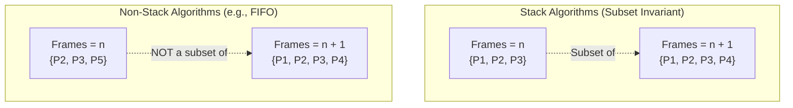

> [!definition] Belady's Anomaly
> Belady's Anomaly is the counterintuitive phenomenon where **increasing the number of allocated physical frames results in an increase in the number of page faults** for a given memory reference string[cite: 4].

> [!theorem] Stack Algorithms Invariant
> A page replacement algorithm is a **Stack Algorithm** if the set of pages resident in memory for $n$ frames is always a strict subset of the pages resident in memory for $n+1$ frames at every reference step:
> $$S(n, t) \subseteq S(n+1, t)$$[cite: 4]
> * **Algorithms immune to Belady's Anomaly**: Optimal (OPT) and Least Recently Used (LRU) are stack algorithms and **never** suffer from Belady's Anomaly[cite: 4].
> * **Algorithms susceptible**: FIFO and LIFO do not satisfy the inclusion property and **can** exhibit Belady's Anomaly[cite: 4].

> [!question] Belady's Anomaly Proof with FIFO
> Reference String: $1,\; 2,\; 3,\; 4,\; 1,\; 2,\; 5,\; 1,\; 2,\; 3,\; 4,\; 5$[cite: 4]
> * **With $3$ Frames (FIFO)**:
>   Trace:
>   * $1, 2, 3 \implies [1, 2, 3]$ (3 PFs)[cite: 4]
>   * $4 \implies$ evicts $1 \to [4, 2, 3]$ (PF 4)[cite: 4]
>   * $1 \implies$ evicts $2 \to [4, 1, 3]$ (PF 5)[cite: 4]
>   * $2 \implies$ evicts $3 \to [4, 1, 2]$ (PF 6)[cite: 4]
>   * $5 \implies$ evicts $4 \to [5, 1, 2]$ (PF 7)[cite: 4]
>   * $1, 2 \implies$ Hits[cite: 4]
>   * $3 \implies$ evicts $1 \to [5, 3, 2]$ (PF 8)[cite: 4]
>   * $4 \implies$ evicts $2 \to [5, 3, 4]$ (PF 9)[cite: 4]
>   * $5 \implies$ Hit[cite: 4]
>   Total Page Faults $= \mathbf{9}$[cite: 4].
> * **With $4$ Frames (FIFO)**:
>   Total Page Faults $= \mathbf{10}$ (derived in previous atom)[cite: 4].
> 
> *Result*: $3\text{ frames} \implies 9\text{ faults}$, while $4\text{ frames} \implies 10\text{ faults}$. This demonstrates Belady's Anomaly[cite: 4].
