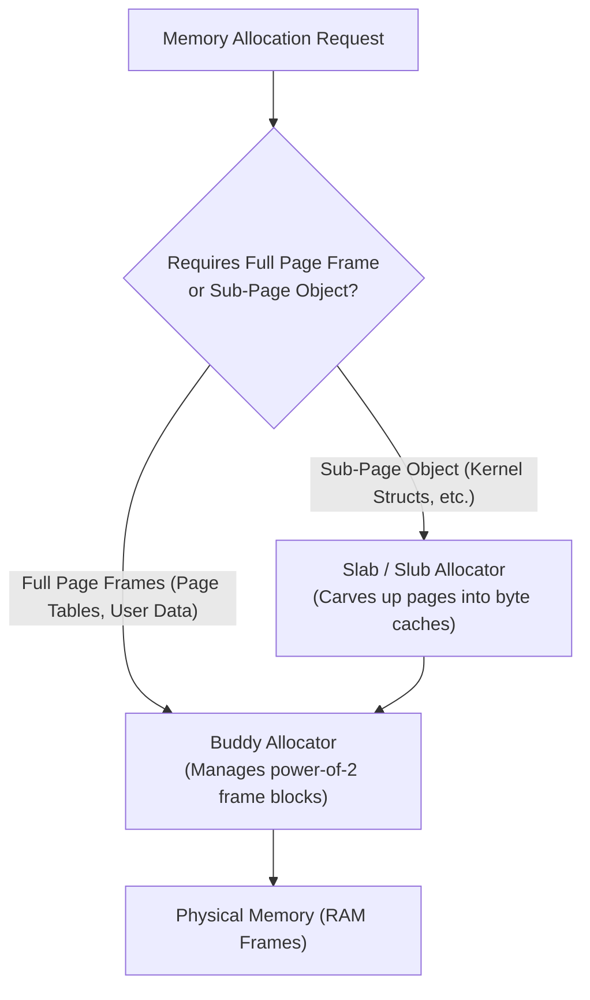
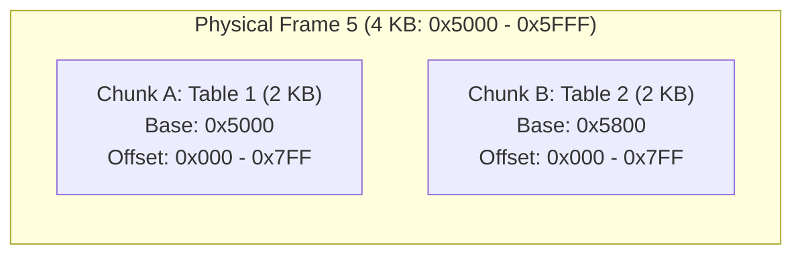

> [!theorem] Chunk Sizing Independence
> It is **not mandatory** that every chunk of a multilevel page table have a size equal to the physical page size. 
> * Chunks at different levels can have different sizes.
> * While standard system implementations set chunk size equal to physical page size for simplicity (so every chunk fits precisely into one page frame), this is an architectural choice, not a theoretical requirement.

> [!trap] Hard Partition Fallacy of Physical RAM
> Physical RAM does not have hardwired physical frame boundaries that permanently freeze chunk dimensions. If chunk size differs from the physical page size, physical memory is partitioned conceptually into frames conforming to the chunk size of that level. Consequently:
> * The number of bits required to specify a frame number depends on the chunk size at that particular level.
> * The number of bits for frame index is given by:
>   $$\text{Bits} = \log_2\left(\frac{\text{PAS}}{\text{Chunk Size}}\right)$$

---

## 1. Dynamic Allocation Layer: Buddy Allocator & Slab Cache

In modern kernels, physical RAM is managed by a hierarchical allocator to fulfill both page-level and sub-page-level requests without chaotic fragmentation.

### Allocator Roles
| Allocator | Allocation Granularity | Primary Responsibility |
| :--- | :--- | :--- |
| **Buddy Allocator** | Power-of-2 page frames ($4\text{ KB}, 8\text{ KB}, 16\text{ KB}, \dots$) | Eliminates external fragmentation; merges/splits adjacent buddy blocks. |
| **Slab / Slub Allocator** | Arbitrary byte sizes / small objects | Pre-allocates full frames from the Buddy Allocator and slices them into object caches. |

---

## 2. Hardware Addressing: Concatenation vs. Addition

Hardware Memory Management Units (MMUs) must translate addresses in fractions of a nanosecond. The mathematical relationship between chunk size and physical frame boundaries determines whether the hardware can simply splice wires or must compute additions.

### The Concatenation vs. Addition Trade-Off
| Feature | Power-of-2 Sized Chunks ($2^k$) | Arbitrary / Non-Power-of-2 Chunks (e.g., $3\text{ KB}$) |
| :--- | :--- | :--- |
| **Boundary Alignment** | Natural alignment to multiples of $2^k$ | Arbitrary byte boundaries |
| **Trailing Base Bits** | Lowest $k$ bits are strictly zero (`...000`) | Non-zero, irregular bit patterns |
| **Translation Logic** | **Bit Concatenation** (wire splicing) | **Full Addition** ($\text{Base} + \text{Offset}$) |
| **Hardware Latency** | $0$ logic cycles (instantaneous) | Adder propagation delay on critical memory path |
| **Internal Waste** | Internal fragmentation within power-of-2 slot | No internal fragmentation (tight packing) |

---

## 3. Sub-Frame Chunks & Natural Alignment Invariants

Even when a page table chunk is **strictly smaller than the standard physical frame size** (e.g., a $2\text{ KB}$ table inside a system with $4\text{ KB}$ frames), finding the offset and forming the physical address remains trivial via bit concatenation as long as the chunk size is a power of 2 ($2^k$).

### The Natural Alignment Invariant
* Let Physical Address Space ($\text{PAS}$) $= 36\text{ bits}$ ($2^{36}\text{ B}$).
* Standard Data Frame Size $= 4\text{ KB} = 2^{12}\text{ B}$.
* Page Table Chunk Size $= 2\text{ KB} = 2^{11}\text{ B}$.

Because $2\text{ KB}$ is a power of 2 ($2^{11}$), the OS memory manager naturally aligns the table to a $2\text{ KB}$ boundary in physical memory. The lowest $11$ bits of its physical base address are guaranteed to be zero:
$$\text{Base Address} = [\,\underbrace{b_{35} \, b_{34} \, \dots \, b_{11}}_{25\text{ bits}}\, ] \;\Vert{}\; [\,\underbrace{00000000000_2}_{11\text{ bits}}\,]$$

* **Offset bits needed:** $\log_2(2\text{ KB}) = 11\text{ bits}$.
* **Parent PTE requirement:** Needs to store only the upper $36 - 11 = \mathbf{25\text{ bits}}$ (the $2\text{ KB}$ chunk identifier).
* **Address Generation:** The MMU directly concatenates the $25$-bit base field with the $11$-bit index offset:
$$\text{Physical Entry Address} = [\,25\text{ bits from PTE}\,] \;\Vert{}\; [\,11\text{ bits of Index Offset}\,]$$

No arithmetic adder is required.

---

## 4. Worked Example: Packing Multiple Tables into a Single Frame

Consider physical frame number $5$ (spanning byte range `0x5000` to `0x5FFF`, size $4\text{ KB}$):

### Allocation Breakdown
| Page Table | Physical Starting Address | Binary Representation (36 bits) | Stored PTE Base Bits (Upper 25 bits) |
| :--- | :--- | :--- | :--- |
| **Table 1** | `0x000005000` | `... 0000 0101 0000` `0000 0000 000` | Matches chunk ID $A$ |
| **Table 2** | `0x000005800` | `... 0000 0101 1000` `0000 0000 000` | Matches chunk ID $B$ |

1. **Both fit without collision:** The OS marks both $2\text{ KB}$ slots as allocated; their physical ranges do not overlap.
2. **Concatenation works for both:** Table 1 has $11$ trailing zeros; Table 2 has $11$ trailing zeros.
3. **Hardware access:** The MMU splices the $9$-bit entry index scaled by $4\text{ B}$ ($11$ bits total) directly onto the $25$-bit chunk number stored in the parent table.

---

## 5. Variable Chunk Size Analysis & Problem Derivations

### Analysis: 2-Level Paging with Equal Indexing Bits
System Parameters:
* $\text{VAS} = 32\text{ bits}$, $\text{PAS} = 32\text{ bits}$
* $\text{Page Size} = 4\text{ KB} = 2^{12}\text{ B}$
* $\text{Levels} = 2$
* Equal indexing bits used for Level 1 and Level 2
* $\text{PTE} = 4\text{ B}$

Calculations:
1. **Address Split**:
   $$\text{Offset } d = \log_2(4\text{ KB}) = 12\text{ bits}$$
   $$\text{Remaining bits} = 32 - 12 = 20\text{ bits}$$
   $$\text{Bits per level} = \frac{20}{2} = 10\text{ bits each}$$
   $$\text{Address Split: } [10 \mid 10 \mid 12]$$
2. **PTEs per page (table)**:
   $$\text{Number of PTEs per page} = \frac{\text{Page Size}}{\text{PTE Size}} = \frac{2^{12}\text{ B}}{4\text{ B}} = 2^{10}\text{ entries}$$
3. **Extra bits available in PTE**:
   $$\text{Number of physical frames} = \frac{\text{PAS}}{\text{Page Size}} = \frac{2^{32}\text{ B}}{2^{12}\text{ B}} = 2^{20}\text{ frames}$$
   $$\text{Frame bits required} = 20\text{ bits}$$
   $$\text{PTE Size} = 4\text{ B} = 32\text{ bits}$$
   $$\text{Extra / Unused bits} = 32 - 20 = 12\text{ bits}$$

---

### GATE CSE 2008 Variant: Frame Bits with Variable Chunk Sizes
System Parameters:
* $\text{VAS} = 32\text{ bits}$, $\text{PAS} = 36\text{ bits}$, $\text{Page Size} = 4\text{ KB} = 2^{12}\text{ B}$
* $\text{PTE} = 4\text{ B} = 2^2\text{ B}$
* A $3$-level page table hierarchy is used with the virtual address split: $[2 \mid 9 \mid 9 \mid 12]$
* Question: What are the number of bits required to address the next level chunk/frame from Level 2, Level 1, and Level 0 respectively?

Detailed Mathematical Derivation:
1. **Chunk Sizes at each level**:
   * Innermost Level (Data Pages): $\text{Size} = 2^{12}\text{ B}$
   * Level 1 Page Table Chunk: Contains $2^9\text{ entries}$ of size $2^2\text{ B}$ each $\implies \text{Chunk Size} = 2^9 \times 2^2 = 2^{11}\text{ B}$
   * Level 2 Page Table Chunk: Contains $2^9\text{ entries}$ of size $2^2\text{ B}$ each $\implies \text{Chunk Size} = 2^9 \times 2^2 = 2^{11}\text{ B}$
2. **Frame Bits Calculation**:
   * **Level 2 Entries (Points to Level 1 chunk)**:
     Level 1 chunks are of size $2^{11}\text{ B}$.
     $$\text{Number of chunks/frames in physical memory} = \frac{\text{PAS}}{\text{Chunk Size}} = \frac{2^{36}\text{ B}}{2^{11}\text{ B}} = 2^{25}$$
     $$\implies \mathbf{25\text{ bits}}$$
   * **Level 1 Entries (Points to Level 0 chunk)**:
     Level 0 chunks are of size $2^{11}\text{ B}$.
     $$\text{Number of chunks/frames in physical memory} = \frac{\text{PAS}}{\text{Chunk Size}} = \frac{2^{36}\text{ B}}{2^{11}\text{ B}} = 2^{25}$$
     $$\implies \mathbf{25\text{ bits}}$$
   * **Level 0 Entries (Points to Target Data Frame)**:
     Data pages are of size $2^{12}\text{ B}$.
     $$\text{Number of data frames in physical memory} = \frac{\text{PAS}}{\text{Page Size}} = \frac{2^{36}\text{ B}}{2^{12}\text{ B}} = 2^{24}$$
     $$\implies \mathbf{24\text{ bits}}$$

$$\text{Result: } (25,\; 25,\; 24)\text{ bits}$$

> [!trap] Why Store Frame Numbers Instead of Byte Addresses in PTE?
> Page table entries store physical **frame numbers** rather than complete physical **byte addresses**. 
> * Storing frame numbers allows the hardware MMU to replace the virtual page number with the physical frame number and directly append the unmodified page offset.
> * If raw byte addresses were stored, the MMU would need an addition operation $(\text{Base} + \text{Offset})$ rather than a concatenation, increasing hardware latency and complexity.
