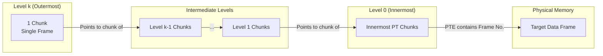

> [!definition] Multilevel Paging Structure
> Multilevel paging is a hierarchical virtual memory management architecture designed to overcome the contiguous allocation bottleneck and memory wastage of monolithic single-level page tables. Instead of allocating a single gigantic table, the page table itself is paged (chunked) recursively into smaller tables.

> [!theorem] The Hierarchical Invariant
> 1. **Equivalence of Levels**: If we consider the inner two levels only, the inner level represents the Logical Address space ($\text{LAS}$), and the immediate next level contains frame numbers of pages of $\text{LAS}$ (identical to standard single-level paging).
> 2. **Recursive Partitioning**: Dividing the page table into page-sized chunks creates an additional level where each entry contains the base address (frame number) of a chunk of the next lower page table level.
> 3. **Termination Condition**: Partitioning stops when the outermost level page table reduces down to a single chunk (i.e., exactly $1$ chunk fitting into a single page frame).
> 4. **Translation Semantics**: Every entry at an intermediate level points to a specific chunk at the next lower level. Entries at the innermost level contain the actual physical frame number of the data page containing the referenced byte.

