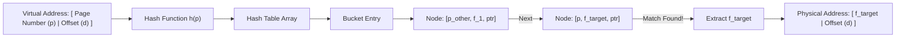

## Architectural Trade-Offs of Paging
While standard paging resolves contiguous physical allocation, it introduces fundamental trade-offs:

| Advantages                                                                                 | Disadvantages                                                                                           |
| :----------------------------------------------------------------------------------------- | :------------------------------------------------------------------------------------------------------ |
| No External Fragmentation: Memory is allocated in uniform, fixed-size frames.              | Internal Fragmentation: Unused leftover bytes within the last allocated page are wasted.                |
| Fast Allocation: Free frames are tracked via a bitmap or free list (no compaction needed). | Memory Overhead: Significant space is required to store page tables (mitigated via multilevel schemes). |
| Protection & Sharing: Easy per-page permission control (Read/Write/Execute).               | Access Latency: Multiple sequential physical memory lookups per single logical reference.               |

## Hashed Page Table Architecture
 To handle virtual address spaces larger than $32\text{ bits}$ without incurring deep $4$-level or $5$-level page table traversals, **Hashed Page Tables** are used as an alternate approach.
 * **Key Idea**: Maintain a hash table where the virtual page number is hashed into a bucket list.
 * **Collision Resolution**: Handled via separate chaining (linked list).
* **Node Elements**: Each linked node contains:
$$[\text{Virtual Page Number } (p) \mid \text{Physical Frame Number } (f) \mid \text{Next Pointer } (\text{ptr})]$$

> [!theorem] Complexity of Hashed Page Tables
> * If a standard two-column array $(\text{Page No}, \text{Frame No})$ is used for only valid pages, searching requires binary search taking $O(\log n)$ time, which is unacceptably slow for hardware MMUs.
> * Hashing with chaining achieves average-case $O(1)$ search latency, making it competitive for sparse $64$-bit address spaces.
