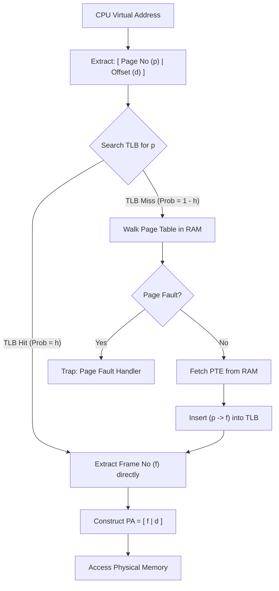

> [!definition] Translation Lookaside Buffer (TLB)
> A TLB is an associative, high-speed on-chip hardware cache located inside the MMU used to accelerate virtual-to-physical address translation[cite: 5, 6].
> * Stores recently resolved subsets of Page Table Entries:
>   $$\text{TLB Entry} = [\text{Tag / Virtual Page Number } (p) \mid \text{Physical Frame Number } (f) \mid \text{Control Bits}]$$[cite: 5]
> * Typical capacity: small, typically $64$ to $512$ entries (rarely exceeds $1024$ entries)[cite: 6].

> [!theorem] The Locality of Reference Principle
> TLBs work effectively due to the program property where $90\%$ of execution time is spent in $10\%$ of code[cite: 6]:
> 1. **Temporal Locality**: Items referenced recently are highly likely to be referenced again in the near future (e.g., loop variables `i`, accumulator `sum`)[cite: 5].
> 2. **Spatial Locality**: Instructions or data elements stored at contiguous or nearby addresses are likely to be accessed sequentially (e.g., sequential array iterations `a[j]`)[cite: 5].



> [!question] Locality Identification in Code Walkthrough
> Consider the loop:
> ```c
> int sum = 0;
> for (int i = 0; i < n; i++) {
>     sum += a[i];
> }
> ```
> Locality classification[cite: 5]:
> * Variable `i`: **Temporal Locality** (referenced on every loop iteration)[cite: 5].
> * Variable `sum`: **Temporal Locality** (repeatedly updated in register/memory)[cite: 5].
> * Array `a[i]`: **Spatial Locality** (contiguous memory words accessed sequentially)[cite: 5].

> [!question] Array Page Boundary and TLB Miss Walkthrough
> Given array `a[]` has $1024$ integer items, each item is $4\text{ B}$[cite: 5].
> Page size $= 4\text{ KB} = 4096\text{ B}$[cite: 5].
> Total array size $= 1024 \times 4\text{ B} = 4096\text{ B} = 1\text{ Page}$[cite: 5].
> System executes:
> ```c
> int sum = 0;
> for (int i = 0; i < 1024; i++) {
>     sum += a[i];
> }
> ```
> TLB Miss Analysis:
> 1. If all entries of `a[]` fit inside **$1$ page** and its translation is not in the TLB initially:
>    * Index $i = 0 \implies$ Page lookup $\implies$ **$1$ TLB Miss** (loads entry into TLB)[cite: 5].
>    * Indices $i = 1$ to $1023 \implies$ **$1023$ TLB Hits**[cite: 5].
>    * Total TLB Misses $= \mathbf{1}$[cite: 5].
> 2. If the array spans across a boundary between **$2$ pages**:
>    * First access to page $1 \implies$ **$1$ TLB Miss**[cite: 5].
>    * First access across boundary to page $2 \implies$ **$1$ TLB Miss**[cite: 5].
>    * Total TLB Misses $= \mathbf{2}$[cite: 5].

> [!question] TLB Reach Fraction
> A system has a $44$-bit Virtual Address Space, page size $= 8\text{ KB} = 2^{13}\text{ B}$, Physical Memory $= 4\text{ GB} = 2^{32}\text{ B}$, and TLB contains $512$ entries[cite: 6].
> What fraction of physical memory can be mapped simultaneously without suffering a TLB miss[cite: 6]?
> 
> Derivation:
> * $\text{Memory mapped by TLB (TLB Reach)} = \text{Entries} \times \text{Page Size} = 512 \times 8\text{ KB} = 2^9 \times 2^{13}\text{ B} = 2^{22}\text{ B} = 4\text{ MB}$[cite: 6].
> * $\text{Fraction of Physical Memory} = \frac{\text{TLB Reach}}{\text{PAS}} = \frac{4\text{ MB}}{4\text{ GB}} = \frac{2^{22}\text{ B}}{2^{32}\text{ B}} = \frac{1}{2^{10}} = \frac{1}{1024}$[cite: 6].
> * Percentage $= \frac{1}{1024} \times 100\% \approx \mathbf{0.0976\%}$[cite: 6].
