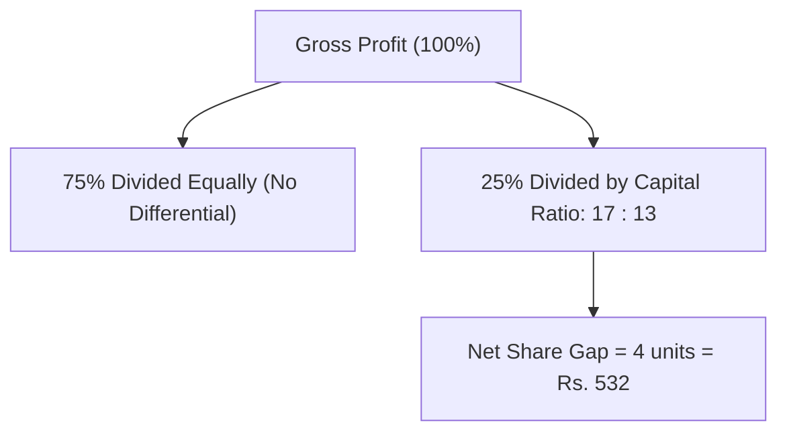

> [!theorem]
> **Partitioned Profit Principle**
> When a portion of the gross profit ($P_{\text{gross}}$) is reserved for active management, salaries, or equal division, that portion is deducted before distributing the remainder based on capital-time ratios[cite: 1]:
> 1. $P_{\text{special}} = \lambda \cdot P_{\text{gross}}$ (e.g., divided equally or paid as salary)[cite: 1]
> 2. $P_{\text{residual}} = (1 - \lambda) \cdot P_{\text{gross}}$ (distributed according to $I_1 T_1 : I_2 T_2$)[cite: 1]
> 
> Net share difference between two partners is determined entirely by their residual allocation[cite: 1]:
> $$\Delta \text{Share} = \Delta \left(\text{Share}_{\text{residual}}\right)$$[cite: 1]

> [!question]
> **Type 7: Partial Equal Distribution Model**
> Two partners invest Rs. $17,000$ and Rs. $13,000$ respectively[cite: 1]. They agree that $75\%$ of the profit is divided equally between them, and the remaining $25\%$ is treated as interest on capital (divided in capital ratio)[cite: 1]. If one partner receives Rs. $532$ more than the other, find the total profit made in the business[cite: 1].
> - 1. $15,960$
> - 2. $34,560$
> - 3. $16,950$
> - 4. $14,590$[cite: 1]
> 
> *Solution:*
> 1. The $75\%$ shared equally creates zero income difference between partners[cite: 1].
> 2. The entire difference of Rs. $532$ comes from the remaining $25\%$ profit divided in capital ratio[cite: 1]:
>    $$\text{Ratio} = 17000 : 13000 = 17 : 13$$[cite: 1]
> 3. Unit difference:
>    $$\Delta = 17 - 13 = 4\text{ units} \equiv \text{Rs. } 532$$[cite: 1]
>    $$1\text{ unit} = \frac{532}{4} = 133$$[cite: 1]
> 4. Value of the $25\%$ profit block:
>    $$25\% \text{ of Profit} = (17 + 13)\text{ units} = 30 \times 133 = \text{Rs. } 3990$$[cite: 1]
> 5. Total gross profit ($100\%$):
>    $$P_{\text{total}} = 3990 \times \frac{100}{25} = 3990 \times 4 = \text{Rs. } 15,960$$[cite: 1]
> **Correct Option: 1**[cite: 1]
