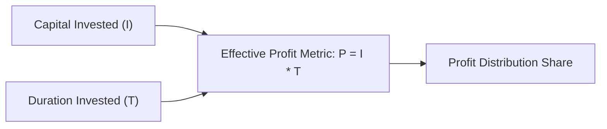

> [!theorem]
> **The Fundamental Partnership Identity**
> Distributed profit ($P$) is directly proportional to the product of financial capital ($I$) and investment duration ($T$)[cite: 1]:
> $$P \propto I \times T \implies \frac{P_1}{P_2} = \frac{I_1 \times T_1}{I_2 \times T_2}$$[cite: 1]
> 
> **Derived Inverse Forms**:
> 1. Investment Capital: $I \propto \frac{P}{T} \implies I_1 : I_2 : I_3 = \frac{P_1}{T_1} : \frac{P_2}{T_2} : \frac{P_3}{T_3}$
> 2. Investment Duration: $T \propto \frac{P}{I} \implies T_1 : T_2 : T_3 = \frac{P_1}{I_1} : \frac{P_2}{I_2} : \frac{P_3}{I_3}$[cite: 1]
> 
> **Dynamic Changing Capital Invariant**:
> When a partner alters their capital at discrete intervals, the total effective investment is the integral sum of capital-time products:
> $$P_{\text{net}} \propto \sum_{k=1}^m \left(I_k \times \Delta t_k\right)$$[cite: 1]

> [!question]
> **Type 6: Fundamental Partnership (Different Time Scales)**
> $A, B,$ and $C$ start a business[cite: 1]. $A$ invests $3\text{ lakh}$ for $4.5\text{ years}$, $B$ invests $5\text{ lakhs}$ for $33\text{ months}$, and $C$ invests $4\text{ lakhs}$ for $3\text{ years}$[cite: 1]. Find the ratio of their profits[cite: 1].
> - 1. $54 : 55 : 48$
> - 2. $66 : 18 : 22$
> - 3. $66 : 36 : 10$
> - 4. $33 : 28 : 19$[cite: 1]
> 
> *Solution:*
> Convert all durations into uniform units of months[cite: 1]:
> - $T_A = 4.5 \times 12 = 54\text{ months}$[cite: 1]
> - $T_B = 33\text{ months}$[cite: 1]
> - $T_C = 3 \times 12 = 36\text{ months}$[cite: 1]
> Set up the profit ratio $P = I \times T$[cite: 1]:
> $$P_A : P_B : P_C = (3 \times 54) : (5 \times 33) : (4 \times 36)$$[cite: 1]
> Divide by common factor $3$[cite: 1]:
> $$P_A : P_B : P_C = 54 : (5 \times 11) : (4 \times 12) = 54 : 55 : 48$$[cite: 1]
> **Correct Option: 1**[cite: 1]

> [!question]
> **PYQ (CDS 1 2023): Five-Partner Proportionality**
> $A, B, C, D,$ and $E$ invest money in the ratio $2 : 3 : 4 : 5 : 6$ for durations in the ratio $6 : 5 : 4 : 3 : 2$[cite: 1]. If profit is directly proportional to time and money invested, who receives the highest profit?[cite: 1]
> - (a) $C$
> - (b) Both $B$ and $D$
> - (c) Both $C$ and $D$
> - (d) All get equal profit[cite: 1]
> 
> *Solution:*
> Compute product terms $P_i = I_i \times T_i$[cite: 1]:
> - $P_A = 2 \times 6 = 12$[cite: 1]
> - $P_B = 3 \times 5 = 15$[cite: 1]
> - $P_C = 4 \times 4 = 16$[cite: 1]
> - $P_D = 5 \times 3 = 15$[cite: 1]
> - $P_E = 6 \times 2 = 12$[cite: 1]
> The profit ratio is $12 : 15 : 16 : 15 : 12$[cite: 1].
> The highest share belongs to $C$ ($16\text{ units}$)[cite: 1].
> **Correct Option: (a)**[cite: 1]

> [!question]
> **Time Duration Isolation**
> $A, B,$ and $C$ invest in the ratio $3 : 6 : 5$ and earn profits in the ratio $2 : 1 : 3$[cite: 1]. Find the ratio of time for which their capital was invested[cite: 1].
> - 1. $20 : 5 : 18$
> - 2. $25 : 20 : 10$
> - 3. $13 : 17 : 19$
> - 4. $5 : 7 : 10$[cite: 1]
> 
> *Solution:*
> Using $T = \frac{P}{I}$[cite: 1]:
> $$T_A : T_B : T_C = \frac{2}{3} : \frac{1}{6} : \frac{3}{5}$$[cite: 1]
> Multiply by $\operatorname{LCM}(3, 6, 5) = 30$[cite: 1]:
> $$30 \times \left(\frac{2}{3} : \frac{1}{6} : \frac{3}{5}\right) = 20 : 5 : 18$$[cite: 1]
> **Correct Option: 1**[cite: 1]

> [!question]
> **Capital Equations with Fixed Annual Time**
> In a business, twice of $A$'s capital is equal to three times of $B$'s capital, which is equal to four times of $C$'s capital[cite: 1]. Out of a total profit of Rs. $19,500$ at the end of the year, find $B$'s share[cite: 1].
> - 1. $6000$
> - 2. $5000$
> - 3. $7000$
> - 4. $8000$[cite: 1]
> 
> *Solution:*
> Given $2A = 3B = 4C$[cite: 1].
> Divide by $\operatorname{LCM}(2, 3, 4) = 12$[cite: 1]:
> $$\frac{A}{6} = \frac{B}{4} = \frac{C}{3} \implies I = 6 : 4 : 3$$[cite: 1]
> Since duration is equal ($12\text{ months}$ each), profit matches capital ratio[cite: 1]:
> $$P = 6 : 4 : 3 \quad (\text{Total units} = 13)$$[cite: 1]
> $$B\text{'s share} = \frac{4}{13} \times 19500 = 4 \times 1500 = \text{Rs. } 6000$$[cite: 1]
> **Correct Option: 1**[cite: 1]

> [!question]
> **Early Withdrawal Equation**
> $A$ and $B$ invest in the ratio $5 : 6$[cite: 1]. At the end of $8\text{ months}$, $A$ withdraws[cite: 1]. If they receive profits in the ratio $5 : 9$, find how long $B$'s investment was used[cite: 1].
> - 1. $12\text{ months}$
> - 2. $15\text{ months}$
> - 3. $10\text{ months}$
> - 4. $14\text{ months}$[cite: 1]
> 
> *Solution:*
> Set up the ratio equation[cite: 1]:
> $$\frac{I_A \times T_A}{I_B \times T_B} = \frac{P_A}{P_B}$$[cite: 1]
> $$\frac{5 \times 8}{6 \times T_B} = \frac{5}{9}$$[cite: 1]
> Cancel $5$ on both sides[cite: 1]:
> $$\frac{8}{6 \times T_B} = \frac{1}{9} \implies 6 T_B = 72 \implies T_B = 12\text{ months}$$[cite: 1]
> **Correct Option: 1**[cite: 1]

> [!question]
> **PYQ (AFCAT 2 2024): Late Entrant Duration**
> Mayank started a business investing Rs. $9000$[cite: 1]. After $5\text{ months}$, Santosh joins with a capital of Rs. $8000$[cite: 1]. If at the end of the year they earn a profit of Rs. $6970$, what is Santosh's share?[cite: 1]
> - 1. $2380$
> - 2. $6570$
> - 3. $3450$
> - 4. $2235$[cite: 1]
> 
> *Solution:*
> Durations over the 1-year ($12\text{ months}$) period[cite: 1]:
> - $T_{\text{Mayank}} = 12\text{ months}$[cite: 1]
> - $T_{\text{Santosh}} = 12 - 5 = 7\text{ months}$[cite: 1]
> Ratio of profits:
> $$P_M : P_S = (9000 \times 12) : (8000 \times 7)$$[cite: 1]
> $$= (9 \times 12) : (8 \times 7) = 108 : 56 = 27 : 14 \quad (\text{Total units} = 41)$$[cite: 1]
> Santosh's share:
> $$\text{Share} = \frac{14}{41} \times 6970 = 14 \times 170 = \text{Rs. } 2380$$[cite: 1]
> **Correct Option: 1**[cite: 1]

> [!question]
> **Dynamic Multi-Period Stepped Capital (AFCAT 1 2025)**
> $A, B,$ and $C$ start a business investing in the ratio $4 : 1 : 15$[cite: 1]. After every quarter, $A$ halves his investment, $B$ doubles his investment, and $C$ keeps his constant[cite: 1]. If at the end of the year $B$'s share of profit is Rs. $22,000$, find the total profit[cite: 1].
> - 1. $1,210,000$
> - 2. $121,000$
> - 3. $123,000$
> - 4. None[cite: 1]
> 
> *Solution:*
> 1. Compute effective capital-months per partner across $4$ quarters ($3\text{ months}$ each)[cite: 1]:
>    - **Partner A**:
>      $$P_A = 4(3) + 2(3) + 1(3) + 0.5(3) = 12 + 6 + 3 + 1.5 = 22.5\text{ unit-months}$$[cite: 1]
>    - **Partner B**:
>      $$P_B = 1(3) + 2(3) + 4(3) + 8(3) = 3 + 6 + 12 + 24 = 45\text{ unit-months}$$[cite: 1]
>    - **Partner C**:
>      $$P_C = 15(12) = 180\text{ unit-months}$$[cite: 1]
> 2. Formulate simplified profit ratio:
>    $$P_A : P_B : P_C = 22.5 : 45 : 180$$[cite: 1]
>    Divide by $22.5$:
>    $$P_A : P_B : P_C = 1 : 2 : 8 \quad (\text{Total units} = 1 + 2 + 8 = 11)$$[cite: 1]
> 3. Solve for total profit:
>    $$B\text{'s share} = 2x = 22000 \implies x = 11000$$[cite: 1]
>    $$\text{Total Profit} = 11x = 11 \times 11000 = \text{Rs. } 121,000$$[cite: 1]
> **Correct Option: 2**[cite: 1]

> [!question]
> **PYQ (AFCAT 1 2024): Mid-Term Percentage Capital Adjustments**
> $A$ and $B$ enter into partnership with capital in the ratio $\frac{4}{3} : \frac{5}{6}$[cite: 1]. After $6\text{ months}$, $A$ reduces his capital by $25\%$ and $B$ increases his capital by $50\%$[cite: 1]. What is the share of $B$ (in lakhs) in a total annual profit of Rs. $63.6\text{ lakhs}$?[cite: 1]
> - 1. $32.5$
> - 2. $30$
> - 3. $32$
> - 4. $33.6$[cite: 1]
> 
> *Solution:*
> 1. Clear fractional capital by multiplying by $\operatorname{LCM}(3, 6) = 6$[cite: 1]:
>    $$I_A : I_B = \left(6 \times \frac{4}{3}\right) : \left(6 \times \frac{5}{6}\right) = 8 : 5$$[cite: 1]
> 2. Track investments across both $6\text{-month}$ periods[cite: 1]:
>    - **Partner A**:
>      - Months 1–6: $8$
>      - Months 7–12: $8 \times (1 - 0.25) = 8 \times 0.75 = 6$[cite: 1]
>      $$P_A = 8(6) + 6(6) = 48 + 36 = 84$$[cite: 1]
>    - **Partner B**:
>      - Months 1–6: $5$
>      - Months 7–12: $5 \times (1 + 0.50) = 5 \times 1.5 = 7.5$[cite: 1]
>      $$P_B = 5(6) + 7.5(6) = 30 + 45 = 75$$[cite: 1]
> 3. Formulate profit ratio:
>    $$P_A : P_B = 84 : 75$$[cite: 1]
>    Divide by $3$:
>    $$P_A : P_B = 28 : 25 \quad (\text{Total units} = 28 + 25 = 53)$$[cite: 1]
> 4. Calculate share of $B$:
>    $$B = \frac{25}{53} \times 63.6\text{ lakhs} = 25 \times 1.2 = \text{Rs. } 30\text{ lakhs}$$[cite: 1]
> **Correct Option: 2**[cite: 1]
