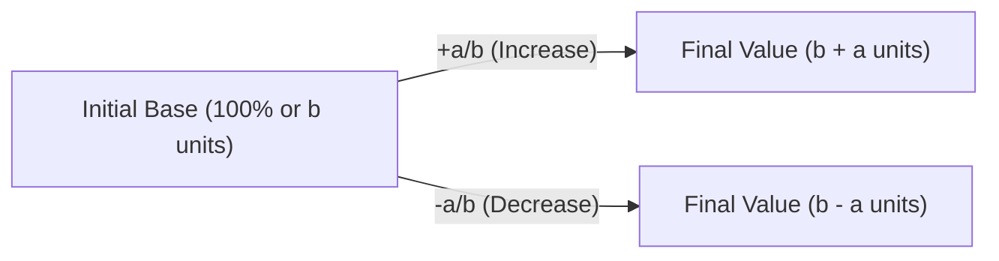

> [!definition]
> **Percentage** literally means "per hundred" (out of 100)[cite: 1]. It represents a dimensionless ratio or fraction with a denominator of $100$[cite: 1].
> - To convert a fraction $\frac{a}{b}$ into a percentage: multiply by $100\%$[cite: 1].
> - To convert a percentage $P\%$ into a fraction: divide by $100$[cite: 1].

> [!theorem]
> **The Universal Ratio Multiplier Method (Master Invariant Approach)**
> Every percentage problem evaluates a transformation between a baseline (base quantity $B$) and a target quantity $T$:
> $$T = B \times \left(1 \pm \frac{R}{100}\right) = B \times M$$
> where $M$ is the **multiplier**.
> - **Intuition**: All percentage arithmetic simplifies to scaling ratios. Instead of computing percentage values and adding/subtracting them in separate steps, convert every percentage change into a fractional multiplier:
>   - $+30\% \implies M = 1 + \frac{3}{10} = \frac{13}{10}$ (Ratio: $10 \to 13$)[cite: 1]
>   - $-30\% \implies M = 1 - \frac{3}{10} = \frac{7}{10}$ (Ratio: $10 \to 7$)[cite: 1]
> - **Proof**: Let initial quantity be $x$.
>   - An increase of $R\%$ produces $x_{\text{new}} = x + x \left(\frac{R}{100}\right) = x \left(1 + \frac{R}{100}\right)$[cite: 1].
>   - Expressing $R\% = \frac{a}{b}$, the base is $b$ units, the change is $\pm a$ units, making the final value $b \pm a$ units[cite: 1].
>   - Hence: $\text{Base} : \text{Final} = b : (b \pm a)$[cite: 1].

> [!question]
> **Type 1: Basic Definition & Unit Conversion (CDS 2 2025)**
> $100\text{ quintals}$ is what percent of $10\text{ metric tonnes}$?[cite: 1]
> - (a) $1\%$
> - (b) $10\%$
> - (c) $100\%$
> - (d) $1000\%$[cite: 1]
> 
> *Solution:*
> Establish unified standard units ($1\text{ quintal} = 100\text{ kg}$, $1\text{ metric tonne} = 1000\text{ kg}$)[cite: 1]:
> $$\text{Part} = 100\text{ quintals} = 100 \times 100\text{ kg} = 10000\text{ kg}$$[cite: 1]
> $$\text{Whole (Base)} = 10\text{ metric tonnes} = 10 \times 1000\text{ kg} = 10000\text{ kg}$$[cite: 1]
> $$\text{Percentage} = \frac{10000\text{ kg}}{10000\text{ kg}} \times 100 = 100\%$$[cite: 1]
> **Correct Option: (c)**[cite: 1]

> [!question]
> **Exam Question: Relative Percentage Relation (AFCAT 1 2024)**
> If $80\%$ of $A = 50\%$ of $B$ and $B = x\%$ of $A$, then find the value of $x$[cite: 1].
> - 1. $400$
> - 2. $300$
> - 3. $160$
> - 4. $150$[cite: 1]
> 
> *Solution:*
> $$80\% \times A = 50\% \times B \implies 80A = 50B \implies \frac{A}{B} = \frac{5}{8}$$[cite: 1]
> We need $B$ as a percentage of $A$:
> $$B = \frac{8}{5}A = \left(\frac{8}{5} \times 100\right)\% \text{ of } A = 160\% \text{ of } A \implies x = 160$$[cite: 1]
> **Correct Option: 3**[cite: 1]

> [!question]
> **Fraction Modification Problem (AFCAT 2 2025)**
> If the numerator of a fraction is increased by $20\%$ and the denominator is decreased by $10\%$, the fraction becomes $\frac{6}{7}$[cite: 1]. Find the original fraction[cite: 1].
> - 1. $\frac{9}{14}$
> - 2. $\frac{9}{17}$
> - 3. $\frac{3}{11}$
> - 4. $\frac{8}{15}$[cite: 1]
> 
> *Solution:*
> Let original fraction be $\frac{x}{y}$[cite: 1].
> Multiplier for numerator $= 1 + 0.20 = \frac{120}{100}$[cite: 1].
> Multiplier for denominator $= 1 - 0.10 = \frac{90}{100}$[cite: 1].
> $$\frac{x \times \frac{120}{100}}{y \times \frac{90}{100}} = \frac{6}{7} \implies \frac{x \times 12}{y \times 9} = \frac{6}{7} \implies \frac{x \times 4}{y \times 3} = \frac{6}{7}$$[cite: 1]
> $$\frac{x}{y} = \frac{6}{7} \times \frac{3}{4} = \frac{18}{28} = \frac{9}{14}$$[cite: 1]
> **Correct Option: 1**[cite: 1]
