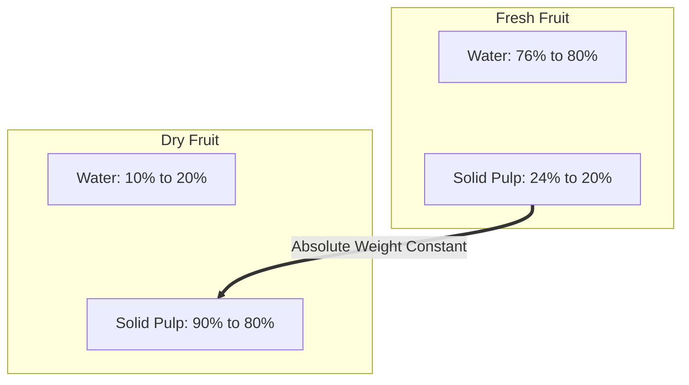

> [!theorem]
> **Pulp Invariant Principle**
> Fruit consists of Water and Solid Pulp[cite: 1]. When fruit dries, water evaporates, but the **absolute mass of pulp remains constant**[cite: 1]:
> $$\text{Pulp Mass} = \text{Fresh Fruit Weight} \times (100 - W_{\text{fresh}})\% = \text{Dry Fruit Weight} \times (100 - W_{\text{dry}})\%$$[cite: 1]

> [!question]
> **Fresh Fruit Problem 1 (Lecture Model)**
> $100\text{ kg}$ of fresh fruits contain $80\%$ water[cite: 1]. How much dry fruit containing $10\%$ water can be obtained from it?[cite: 1]
> 
> *Solution:*
> - In fresh fruit: $\text{Pulp} = 100 - 80 = 20\%$[cite: 1].
> - In dry fruit: $\text{Pulp} = 100 - 10 = 90\%$[cite: 1].
> Equating pulp mass:
> $$100 \times 20\% = x \times 90\% \implies 100 \times 20 = x \times 90 \implies x = \frac{200}{9}\text{ kg}$$[cite: 1]

> [!question]
> **Fresh Fruit Problem 2 (Q9)**
> Fresh fruits contain $76\%$ water and dry fruits contain $20\%$ water[cite: 1]. How much dry fruit can be obtained from $100\text{ kg}$ of fresh fruits?[cite: 1]
> - 1. $35\text{ kg}$
> - 2. $40\text{ kg}$
> - 3. $48\text{ kg}$
> - 4. $30\text{ kg}$[cite: 1]
> 
> *Solution:*
> - Pulp in Fresh fruit $= 100\% - 76\% = 24\%$[cite: 1].
> - Pulp in Dry fruit $= 100\% - 20\% = 80\%$[cite: 1].
> Let mass of dry fruit be $x\text{ kg}$[cite: 1]:
> $$100 \times 24\% = x \times 80\%$$[cite: 1]
> $$100 \times 24 = x \times 80 \implies x = \frac{2400}{80} = 30\text{ kg}$$[cite: 1]
> **Correct Option: 4**[cite: 1]
