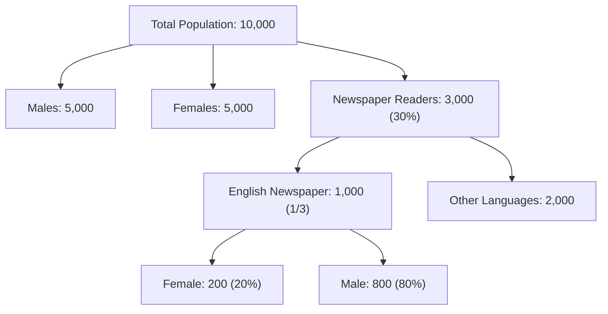

> [!theorem]
> **Hierarchical Tree Decomposition**
> In multistage demographic problems, calculate independent splits downstream rather than mixing orthogonal branches (e.g., gender vs. readership)[cite: 1].

> [!question]
> **Demographic Newspaper Readers (CDS 2 2024)**
> The total population of an area is $10,000$, out of which males and females are equal in number[cite: 1]. Out of the total population, $30\%$ are newspaper readers[cite: 1]. Out of the total newspaper readers, one-third read English newspapers[cite: 1]. Out of the English newspaper readers, $20\%$ are females[cite: 1]. What is the number of males who do not read English newspapers?[cite: 1]
> - (a) $800$
> - (b) $2100$
> - (c) $4200$
> - (d) Cannot be determined due to insufficient data[cite: 1]
> 
> *Solution:*
> 1. Total Males $= \frac{10000}{2} = 5000$[cite: 1].
> 2. Newspaper readers $= 30\% \times 10000 = 3000$[cite: 1].
> 3. English newspaper readers $= \frac{1}{3} \times 3000 = 1000$[cite: 1].
> 4. Female English readers $= 20\% \times 1000 = 200$[cite: 1].
>    Male English readers $= 1000 - 200 = 800$[cite: 1].
> 5. Number of males who do not read English newspapers:
>    $$\text{Total Males} - \text{Male English Readers} = 5000 - 800 = 4200$$[cite: 1]
> **Correct Option: (c)**[cite: 1]

> [!question]
> **Literacy Mixture Representation (CDS 2 2025)**
> In a village consisting of $p$ persons, $x\%$ can read and write[cite: 1]. Of the males, only $y\%$ can read and write[cite: 1]. Of the females, only $z\%$ can read and write[cite: 1]. If $x, y > z$, what is the number of males in the village?[cite: 1]
> - (a) $\frac{p(x-z)}{y-z}$
> - (b) $\frac{p(y-z)}{x-z}$
> - (c) $\frac{px}{y}$
> - (d) $\frac{py}{x}$[cite: 1]
> 
> *Solution:*
> Let total males be $M \implies$ females $F = p - M$[cite: 1].
> Equating literate individuals:
> $$\text{Total Literate} = \frac{x}{100}p$$[cite: 1]
> $$\text{Male Literate} + \text{Female Literate} = \frac{y}{100}M + \frac{z}{100}(p - M)$$[cite: 1]
> Set equations equal:
> $$\frac{y}{100}M + \frac{z}{100}p - \frac{z}{100}M = \frac{x}{100}p$$[cite: 1]
> $$M(y - z) + pz = px \implies M(y - z) = p(x - z)$$[cite: 1]
> $$M = \frac{p(x - z)}{y - z}$$[cite: 1]
> **Correct Option: (a)**[cite: 1]
