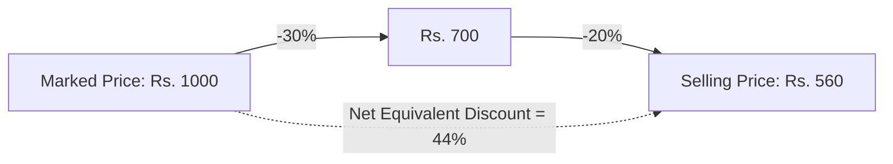

> [!definition]
> **Marked Price (MP) and Discount**:
> A discount is a percentage reduction applied to the Marked Price (or List Price) to produce the Selling Price (SP)[cite: 1]:
> $$\text{SP} = \text{MP} \times \left(1 - \frac{D_1}{100}\right) \times \left(1 - \frac{D_2}{100}\right) \cdots$$[cite: 1]
> The single equivalent discount is the direct percentage reduction from the initial MP to the ultimate SP[cite: 1].

> [!formula]
> For two successive discounts $d_1\%$ and $d_2\%$:
> $$\text{Single Equivalent Discount } D_{\text{eq}} = \left( d_1 + d_2 - \frac{d_1 \cdot d_2}{100} \right)\%$$[cite: 1]

> [!question]
> **Successive Three-Tier Discount (AFCAT 1 2024)**
> Find the single discount equivalent to successive discounts of $20\%$, $15\%$, and $10\%$[cite: 1].
> - 1. $52.6\%$
> - 2. $45\%$
> - 3. $42.2\%$
> - 4. $38.8\%$[cite: 1]
> 
> *Solution:*
> Convert to multipliers ($\text{MP} \to \text{SP}$):
> - $20\% \text{ discount} = \frac{1}{5} \implies 5 \to 4$[cite: 1]
> - $15\% \text{ discount} = \frac{3}{20} \implies 20 \to 17$[cite: 1]
> - $10\% \text{ discount} = \frac{1}{10} \implies 10 \to 9$[cite: 1]
> Compound product:
> $$\text{Initial Base} = 5 \times 20 \times 10 = 1000$$[cite: 1]
> $$\text{Final SP} = 4 \times 17 \times 9 = 612$$[cite: 1]
> (Or using base $250$: $5 \times 5 \times 10 = 250 \to 1 \times 17 \times 9 = 153$)[cite: 1]
> $$\text{Total Discount} = 1000 - 612 = 388$$[cite: 1]
> $$\text{Equivalent Discount } \% = \frac{388}{1000} \times 100 = 38.8\%$$[cite: 1]
> **Correct Option: 4**[cite: 1]

> [!question]
> **Variable Discount Equation (CDS 1 2026)**
> A single discount which is equivalent to a series of discounts $p\%$, $\frac{p}{2}\%$, and $\frac{p}{4}\%$ is $31.6\%$[cite: 1]. What is the value of $p$?[cite: 1]
> - (a) $24\%$
> - (b) $20\%$
> - (c) $18\%$
> - (d) $16\%$[cite: 1]
> 
> *Solution:*
> Test option (b) $p = 20\%$[cite: 1]:
> Discounts are $20\%$, $10\%$, and $5\%$[cite: 1].
> Converting to multipliers:
> - $20\% \implies 5 \to 4$[cite: 1]
> - $10\% \implies 10 \to 9$[cite: 1]
> - $5\% = \frac{1}{20} \implies 20 \to 19$[cite: 1]
> Initial base $= 5 \times 10 \times 20 = 1000$ (or divided by 4: $5 \times 10 \times 5 = 250$)[cite: 1].
> Final value $= 4 \times 9 \times 19 = 684$ (or divided by 4: $1 \times 9 \times 19 = 171$)[cite: 1].
> $$\text{Total Discount} = 250 - 171 = 79$$[cite: 1]
> $$\% \text{ Discount} = \frac{79}{250} \times 100 = \frac{158}{5}\% = 31.6\%$$[cite: 1]
> This matches the given $31.6\%$, so $p = 20\%$[cite: 1].
> **Correct Option: (b)**[cite: 1]

> [!question]
> **Discount with Wallet Cashback (Q11)**
> A person buys an item from a shop for which the shopkeeper offers a discount of $10\%$ on the marked price[cite: 1]. The person pays using an e-wallet which gives $10\%$ cashback[cite: 1]. Which one of the following is the value of effective discount?[cite: 1]
> - A. $20\%$
> - B. $18\%$
> - C. $19\%$
> - D. $21\%$[cite: 1]
> 
> *Solution:*
> Applying two successive discounts of $-10\%$ and $-10\%$:
> $$\text{Net Reduction} = -10 - 10 + \frac{(-10)(-10)}{100} = -20 + 1 = -19\%$$[cite: 1]
> Effective discount is $19\%$[cite: 1].
> **Correct Option: C**[cite: 1]
