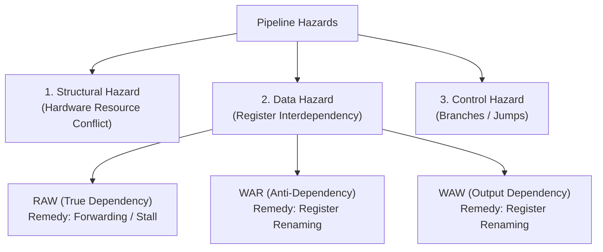

> [!definition]
> - **Pipelining**: An implementation technique where multiple instructions are overlapped in execution across an assembly line of hardware stages.
> - **Hazard**: Any condition that prevents the next instruction from executing in its designated clock cycle, requiring stalls (bubbles).



> [!theorem]
> **Data Hazard Classifications (Bernstein's Conditions)**:
> 1. **RAW (Read-After-Write) [True Dependency]**:
>    - Instruction $I_2$ tries to read a register before $I_1$ writes to it ($W(I_1) \cap R(I_2) \neq \emptyset$).
>    - Cannot be resolved by renaming; requires **Operand Forwarding** or pipeline stalls.
> 2. **WAR (Write-After-Read) [Anti-Dependency]**:
>    - Instruction $I_2$ tries to overwrite a register before $I_1$ reads it ($R(I_1) \cap W(I_2) \neq \emptyset$).
>    - Arises in out-of-order execution; eliminated completely via **Register Renaming**.
> 3. **WAW (Write-After-Write) [Output Dependency]**:
>    - Instruction $I_2$ tries to overwrite a register before $I_1$ finishes writing its older result ($W(I_1) \cap W(I_2) \neq \emptyset$).
>    - Eliminated via **Register Renaming**.
> 4. **RAR (Read-After-Read)**:
>    - Multiple instructions read the same register ($R(I_1) \cap R(I_2) \neq \emptyset$). Not a hazard.

> [!trap]
> In an in-order pipeline, WAR and WAW hazards are physically impossible because instruction decode (register read) always completes before write-back across sequential instructions. WAR and WAW occur only in **out-of-order execution** engines.

> [!question]
> Identify the hazard type present between instructions $I_1$ and $I_2$:
> ```assembly
> I1: ADD R1, R2, R3
> I2: SUB R4, R1, R5
> ```
> - (A) Structural Hazard
> - (B) RAW Data Hazard
> - (C) WAR Data Hazard
> - (D) WAW Data Hazard
>
> **Correct Option**: **(B)**
> **Explanation**: $I_1$ writes its result into $R_1$, while $I_2$ immediately attempts to read $R_1$ as a source operand. This is a Read-After-Write (RAW) true data dependency.
