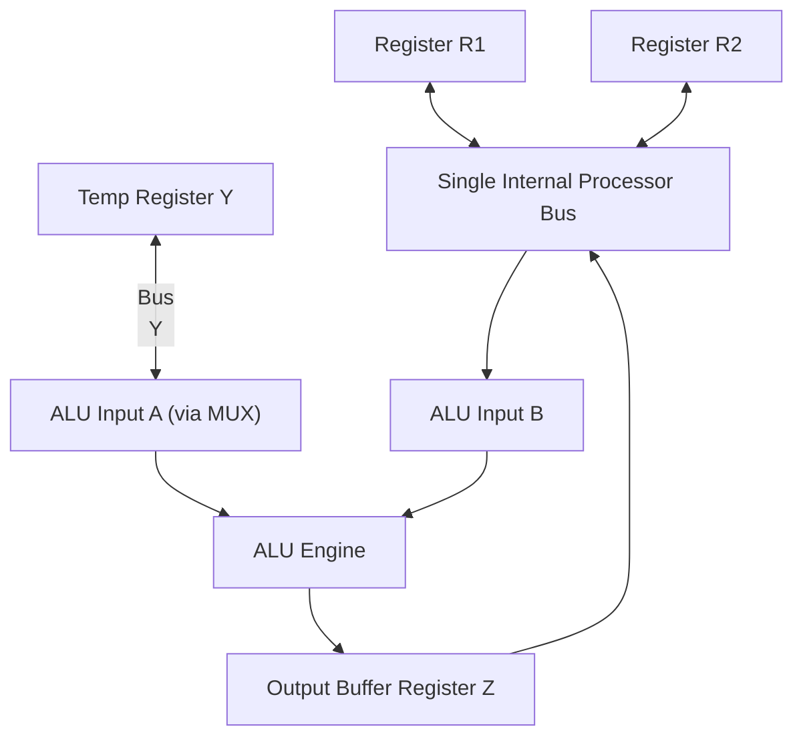

> [!definition]
> The **Data Path** consists of internal processor buses, general-purpose registers, the ALU, and interface registers ($Y, Z$) coordinated to route operands and collect computational results.

> [!theorem]
> **Single Bus Constraint**:
> During any given clock cycle on a single-bus architecture, **only ONE register may assert data onto the bus** ($R_{out} = 1$). However, multiple registers may latch data from the bus simultaneously ($R_{in} = 1$).
> - **Register $Y$ Role**: Latches the first operand from the bus, freeing the bus for the second operand.
> - **Register $Z$ Role**: Isolates the ALU output from the bus to prevent bus conflicts while the second operand is actively driving the bus.

> [!formula]
> **Micro-operation Timing Sequences (Single Bus)**:
> 1. **ALU Operation ($R_3 \leftarrow R_1 + R_2$)**:
>    - Cycle 1: $R1_{out}, \; Y_{in}$
>    - Cycle 2: $R2_{out}, \; \text{Select } Y, \; \text{Add}, \; Z_{in}$
>    - Cycle 3: $Z_{out}, \; R3_{in}$
>
> 2. **Memory Read Operation ($\text{MOV } (R_1), \; R_2$)**:
>    - Cycle 1: $R1_{out}, \; MAR_{in}, \; \text{Read}$
>    - Cycle 2: $WMFC, \; MDR_{inE}$ (Wait for Memory Function Complete)
>    - Cycle 3: $MDR_{out}, \; R2_{in}$
>
> 3. **Complete Instruction Execution ($\text{ADD } (R_3), \; R_1$)**:
>    - Cycle 1 (Fetch): $PC_{out}, \; MAR_{in}, \; \text{Read}, \; \text{Select } 4, \; \text{Add}, \; Z_{in}$
>    - Cycle 2 (Fetch): $Z_{out}, \; PC_{in}, \; Y_{in}, \; WMFC$
>    - Cycle 3 (Fetch): $MDR_{out}, \; IR_{in}$
>    - Cycle 4 (Operand): $R3_{out}, \; MAR_{in}, \; \text{Read}$
>    - Cycle 5 (Operand): $R1_{out}, \; Y_{in}, \; WMFC$
>    - Cycle 6 (ALU): $MDR_{out}, \; \text{Select } Y, \; \text{Add}, \; Z_{in}$
>    - Cycle 7 (Write-Back): $Z_{out}, \; R1_{in}, \; \text{End}$

> [!formula]
> **Three-Bus Parallelism Improvement**:
> In a 3-bus organization (Bus A, Bus B, Bus C), two source operands are fetched concurrently over Bus A and Bus B, and the ALU output is placed directly onto Bus C. The operation $R_6 \leftarrow R_4 + R_5$ drops from **3 cycles to 1 cycle**:
> $$\text{Cycle}: R4_{outA}, \; R5_{outB}, \; \text{Select } A, \; \text{Add}, \; R6_{inC}, \; \text{End}$$

> [!question]
> Why can the operations $R1_{out}, \; Y_{in}$ and $WMFC$ occur safely during the same clock cycle in a single-bus CPU?
> - (A) $WMFC$ operates on the internal processor bus.
> - (B) $R1 \to Y$ uses the internal processor bus, while $WMFC$ waits for external memory bus signals.
> - (C) Register $Y$ is directly connected to the memory data lines.
> - (D) The ALU performs the addition during wait states.
>
> **Correct Option**: **(B)**
> **Explanation**: The transfer $R1 \to Y$ is an internal transaction over the processor's internal bus. $WMFC$ is a control signal monitoring the external memory bus ($MFC$ line). Because different buses are utilized, there is no bus collision.
