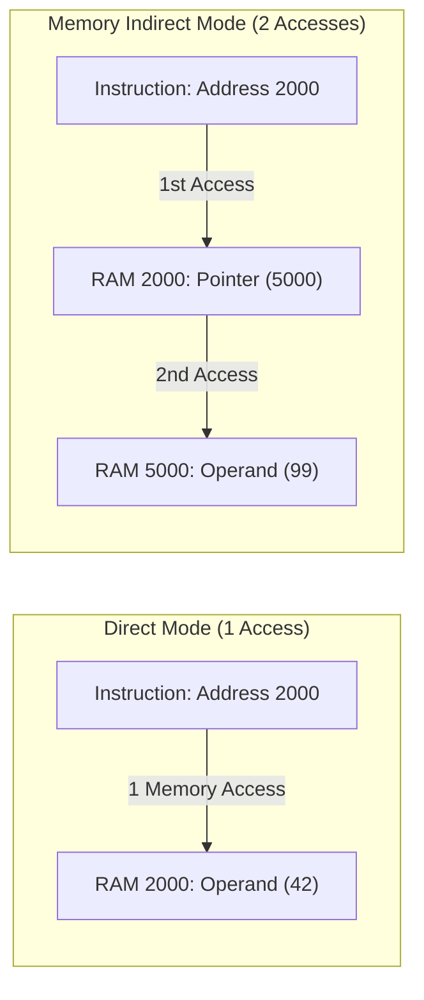

> [!definition]
> An **Addressing Mode** defines the hardware rule for calculating the Effective Address ($EA$) of an operand during instruction execution.

| Addressing Mode | Syntax Pattern | Effective Address ($EA$) | Memory Cycles to Fetch Operand | Primary Architectural Purpose |
| :--- | :--- | :--- | :--- | :--- |
| **Implied / Implicit** | `CLC`, `CMA` | Operands implied in Opcode | 0 | Accumulator / status operations |
| **Immediate** | `MOV R1, #25` | Data embedded in instruction | 0 | Initializing constant literals |
| **Register Direct** | `ADD R1, R2` | $EA = R$ | 0 | High-speed intra-CPU computation |
| **Direct / Absolute** | `LDA 2050H` | $EA = \text{Address Field}$ | 1 | Global and fixed memory access |
| **Register Indirect** | `MOV A, (R1)` | $EA = [R]$ | 1 | Pointer manipulation |
| **Memory Indirect** | `LOAD R1, (1000H)` | $EA = [\text{Address Field}]$ | 2 | Multilevel pointers / object handles |
| **Indexed** | `MOV R1, 100[IX]` | $EA = [IX] + \text{Displacement}$ | 1 | Array base-address traversal |
| **Base-Register** | `LOAD R1, 20[BR]` | $EA = [BR] + \text{Displacement}$ | 1 | Runtime program relocation |
| **Relative (PC)** | `JMP +16` | $EA = [PC] + \text{Displacement}$ | 1 | Branching / Position-independent code |
| **Auto-Increment** | `MOV (R1)+, R2` | $EA = [R1], \; R1 \leftarrow R1 + d$ | 1 | Sequential array indexing in loops |
| **Auto-Decrement** | `MOV -(R1), R2` | $R1 \leftarrow R1 - d, \; EA = [R1]$ | 1 | Stepping backwards / Stack emulation |

> [!trap]
> - **Memory References**: Do not confuse instruction fetch memory cycles with operand fetch memory cycles. A direct addressing mode instruction requires 1 memory access for the operand, plus the instruction fetch cycles.
> - **Auto-Increment vs Auto-Decrement**: Auto-increment reads memory *before* incrementing ($EA = [R]; \; R \leftarrow R + 1$). Auto-decrement decrements the register *before* reading memory ($R \leftarrow R - 1; \; EA = [R]$).

> [!question]
> Which addressing modes are suited for runtime program relocation without rewriting code addresses?
> - (A) Direct and Memory Indirect
> - (B) Base Register and PC-Relative
> - (C) Immediate and Implied
> - (D) Register Direct and Auto-decrement
>
> **Correct Option**: **(B)**
> **Explanation**: Base Register mode computes $EA = [BR] + \text{Offset}$, allowing the OS to relocate a program anywhere in RAM simply by changing the Base Register. PC-Relative computes branch targets relative to the current Program Counter, maintaining offset validity regardless of absolute placement.
