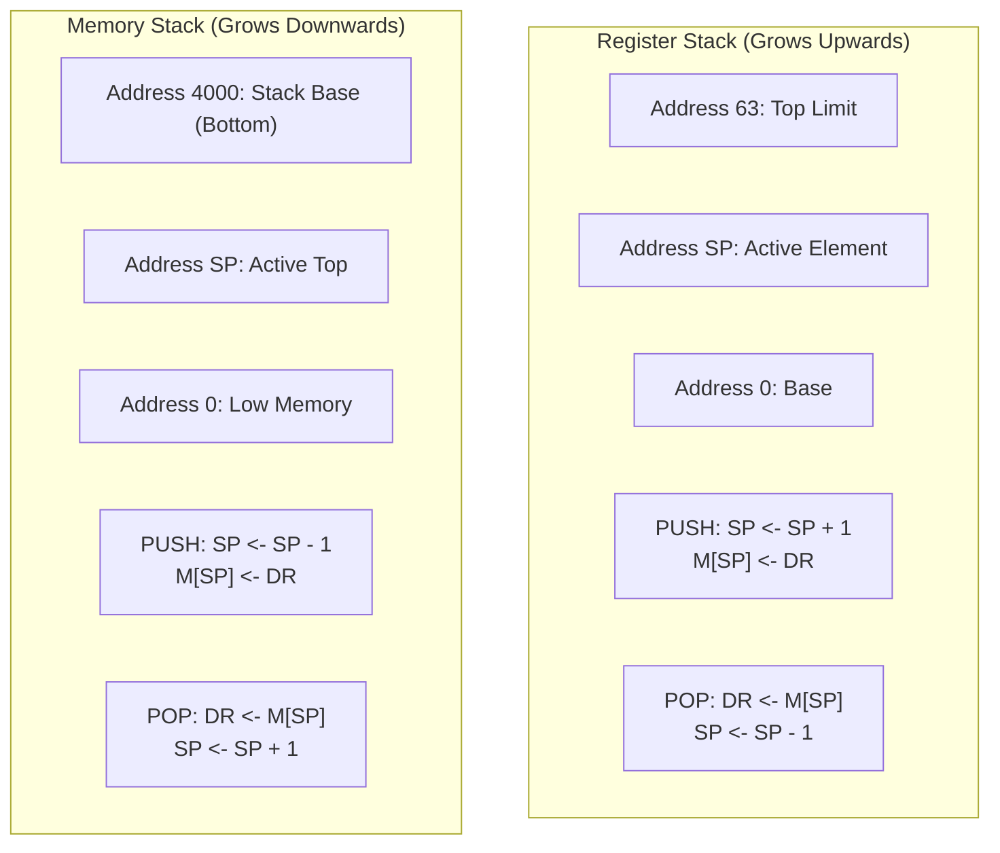

> [!definition]
> - **Register Stack**: A small stack built from a dedicated array of high-speed processor registers, bounded by hardware flags.
> - **Memory Stack**: A logical stack mapped into standard main memory (RAM), bounded by software addresses and tracked via the Stack Pointer ($SP$).

| Architectural Feature | Register Stack (Handbook Convention) | Memory Stack (RAM Convention) |
| :--- | :--- | :--- |
| **Physical Implementation** | Dedicated CPU Flip-Flop Array | Reserved Main Memory Segment |
| **Execution Latency** | 1 clock cycle (Zero memory bus latency) | Multi-cycle (Memory bus cycles + wait states) |
| **Hardware Boundary Flags** | Hardware Flip-Flops: `FULL` and `EMPTY` | OS Page Bounds / Memory Limits |
| **Growth Direction** | **Upwards** (Toward higher addresses) | **Downwards** (Toward lower addresses) |
| **PUSH Micro-operation** | $SP \leftarrow SP + 1; \quad M[SP] \leftarrow DR$ | $SP \leftarrow SP - 1; \quad M[SP] \leftarrow DR$ |
| **POP Micro-operation** | $DR \leftarrow M[SP]; \quad SP \leftarrow SP - 1$ | $DR \leftarrow M[SP]; \quad SP \leftarrow SP + 1$ |

> [!trap]
> **Roll-over Behavior in Register Stack**:
> In a 64-word register stack, $SP$ is a 6-bit register ($2^6 = 64$).
> - Initial state: $SP = 000000_2$, $\text{EMPTY} = 1$, $\text{FULL} = 0$.
> - After 63 pushes: $SP = 111111_2 = 63$.
> - On the 64th push: $SP \leftarrow SP + 1 = 64 \equiv 000000_2$ (overflow wrap-around).
> - When $SP$ rolls over to $0$ on a PUSH, hardware asserts $\text{FULL} = 1$ and clears $\text{EMPTY} = 0$.

> [!question]
> A 64-word register stack uses a 6-bit Stack Pointer initialized to $SP = 0$, $\text{EMPTY} = 1$, $\text{FULL} = 0$. Exactly 64 successive PUSH operations are executed without any intervening POPs. What are the final values of $SP$, $\text{FULL}$, and $\text{EMPTY}$?
> - (A) $SP = 63, \; \text{FULL} = 1, \; \text{EMPTY} = 0$
> - (B) $SP = 0, \; \text{FULL} = 1, \; \text{EMPTY} = 0$
> - (C) $SP = 64, \; \text{FULL} = 1, \; \text{EMPTY} = 0$
> - (D) $SP = 0, \; \text{FULL} = 0, \; \text{EMPTY} = 1$
>
> **Correct Option**: **(B)**
> **Explanation**: Because $SP$ is a 6-bit register, the 64th increment wraps around: $63 + 1 = 64 \pmod{64} = 0$. The check condition triggers: `If (SP == 0) then FULL = 1, EMPTY = 0`.
