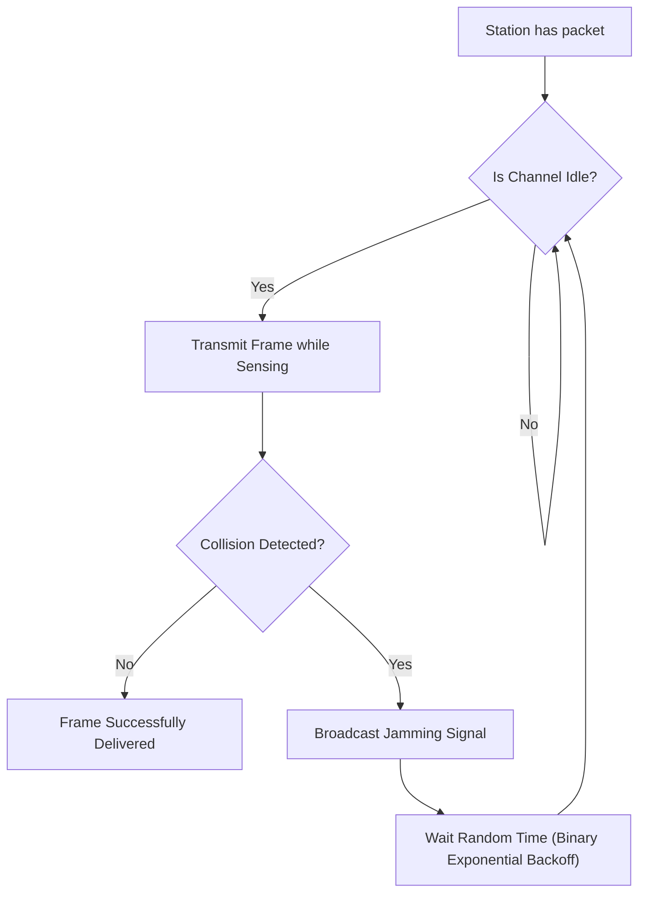
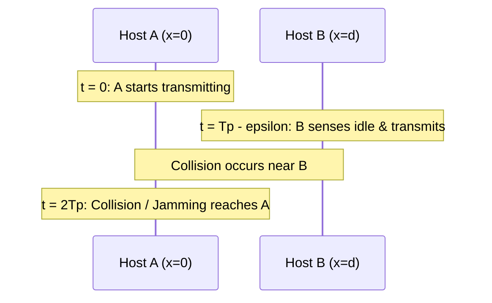

## Carrier Sense Multiple Access with Collision Detection (CSMA/CD)

CSMA improves upon ALOHA via **Carrier Sensing** ("listen before speaking"): a host verifies channel idle status before beginning transmission[cite: 1].

### The Collision Detection Invariant

A transmitting node can detect a collision if and only if the collision signal reaches the sender **before the sender finishes transmitting its frame**[cite: 1].

> [!formula] Minimum Frame Size Invariant
> In the worst case, host A transmits at $t = 0$ and the packet arrives at host B at $t = T_p - \epsilon$[cite: 1]. B transmits, causing an immediate collision[cite: 1]. The collision signal requires an additional $T_p$ to propagate back to A, arriving at $t = 2T_p$[cite: 1].
> To ensure host A is still transmitting when the collision signal returns:
> $$T_t \ge 2T_p$$[cite: 1]
> Since $T_t = \frac{L}{B}$:
> $$\frac{L}{B} \ge 2T_p \implies L \ge 2T_p \times B$$[cite: 1]
When host A detects a collision at time $t = 2T_p$, it immediately stops sending data and switches to transmitting a **Jam Signal** (a short 32-bit to 48-bit burst of noise).
$$T_{\text{jam}} = \frac{\text{Length of Jam Signal (e.g., 48 bits)}}{\text{Bandwidth } B}$$
> $$T_t \ge 2T_p + T_{\text{jam}}$$[cite: 1]

The sender continuously transmits data for at least 2Tp so that it can determine whether the data safely reached the intended host. If a collision occurs, the colliding parties decide to back off for a random amount of time and then retransmit. There is no acknowledgment here. Acknowledgment is a higher-level function (flow control). Everything here is data, and the main goal is to transmit it safely without collision.

> [!question] CSMA/CD Minimum Frame Size Calculations
> 1. A $100\text{ Mbps}$ CSMA/CD network has propagation delay $T_p = 100\text{ }\mu\text{s}$[cite: 1]. Find minimum frame size:
>    $$L_{\min} = 2 \times T_p \times B = 2 \times (100 \times 10^{-6}\text{ s}) \times (100 \times 10^6\text{ bps}) = 20{,}000\text{ bits} = 2500\text{ Bytes}$$[cite: 1]
> 2. An Ethernet link with $10\text{ Mbps}$ bandwidth has round-trip propagation delay $2T_p = 46.4\text{ }\mu\text{s}$ and uses a $48\text{-bit}$ jamming signal[cite: 1]. Calculate minimum frame size[cite: 1]:
>    * $T_{\text{jam}} = \frac{48\text{ bits}}{10 \times 10^6\text{ bps}} = 4.8\text{ }\mu\text{s}$[cite: 1].
>    * $T_t \ge 2T_p + T_{\text{jam}} = 46.4\text{ }\mu\text{s} + 4.8\text{ }\mu\text{s} = 51.2\text{ }\mu\text{s}$[cite: 1].
>    * $L_{\min} = 51.2\text{ }\mu\text{s} \times 10\text{ Mbps} = 512\text{ bits} = 64\text{ Bytes}$[cite: 1].
