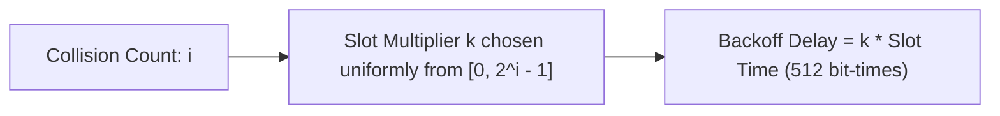

## Binary Exponential Backoff Algorithm

When a collision occurs in CSMA/CD, stations abort transmission, broadcast a 48-bit jamming signal to alert all nodes, and execute the **Truncated Binary Exponential Backoff** algorithm to schedule retransmission[cite: 1].

> [!formula] Backoff Delay Distribution
> After the $i^{\text{th}}$ collision:
> 1. A random integer $k$ is drawn uniformly from the range:
>    $$k \in [0, \, 2^i - 1]$$[cite: 1]
> 2. The station waits a backoff duration:
>    $$\text{Delay} = k \times \text{Slot Time}$$[cite: 1]
>    Where standard Ethernet $\text{Slot Time} = 2T_p = 512\text{ bit transmission times}$ ($51.2\text{ }\mu\text{s}$ at $10\text{ Mbps}$)[cite: 1].
> 3. **Truncation Rule**: The exponent freezes at $i = 10$ ($k \in [0, 1023]$)[cite: 1].
> 4. **Abort Limit**: If collisions reach $i = 16$, the station aborts transmission and signals an unrecoverable network error[cite: 1].

> [!question] Backoff Probability Calculations
> 1. Two stations A and B collide on their $5^{\text{th}}$ attempt ($i = 5$)[cite: 1].
>    * Total choices per station: $2^5 = 32$ slots (range $0$ to $31$)[cite: 1].
>    * Total outcome combinations $= 32 \times 32 = 1024$[cite: 1].
>    * Probability of colliding again (both select identical $k$):
>      $$P(\text{Collision}) = \frac{32}{32 \times 32} = \frac{1}{32} = \frac{1}{2^i}$$[cite: 1]
> 2. Probability that station B successfully transmits immediately while station A waits[cite: 1]:
>    * Requires $k_B = 0$ and $k_A \in [1, 31]$ (31 possibilities)[cite: 1]:
>      $$P(B\text{ wins immediately}) = \frac{31}{32 \times 32} = \frac{31}{1024}$$[cite: 1]
> 3. Station A attempts transmission of a new frame ($i=0 \implies k=0$), while Station B attempts its $4^{\text{th}}$ retransmission ($i=4 \implies k \in [0, 15]$)[cite: 1]. Find the probability that station A wins the race without colliding[cite: 1]:
>    * Station A always chooses slot $0$ ($1$ option)[cite: 1].
>    * Station B has $2^4 = 16$ choices[cite: 1].
>    * Station A wins cleanly if station B picks any slot other than $0$ ($15$ options)[cite: 1]:
>      $$P(\text{A wins}) = \frac{15}{16}$$[cite: 1]
