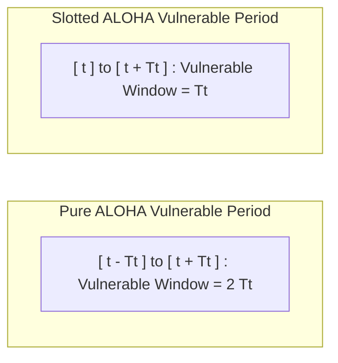

## Pure and Slotted ALOHA

Developed by Norman Abramson for wireless broadcast communication[cite: 1]. In ALOHA, stations transmit autonomously without sensing channel occupancy[cite: 1].

> [!definition] Vulnerable Time
> The continuous time interval during which a transmission is susceptible to colliding with frames generated by any other station[cite: 1]:
> * **Pure ALOHA**: $V_t = 2T_t$[cite: 1]
> * **Slotted ALOHA**: $V_t = T_t$[cite: 1]

### Throughput Derivations (Poisson Traffic)

Assume aggregate frame arrivals follow a Poisson distribution with average generation rate $G$ frames per frame transmission time $T_t$[cite: 1]:
$$P(X = k) = \frac{e^{-\lambda} \lambda^k}{k!}$$
[cite: 1]
A transmission succeeds if and only if zero other frames are generated during its vulnerable period ($P(X = 0)$)[cite: 1].

#### Pure ALOHA Throughput
* Vulnerable period is $2T_t \implies \lambda = 2G$[cite: 1].
* Probability of zero collisions: $P(X = 0) = e^{-2G}$[cite: 1].
* Throughput ($S$):
  $$S = G \cdot e^{-2G}$$
[cite: 1]
* Maximize by setting $\frac{dS}{dG} = e^{-2G}(1 - 2G) = 0 \implies G = \frac{1}{2}$[cite: 1]:
  $$S_{\max} = \frac{1}{2}e^{-1} \approx 0.184 = 18.4\%$$
[cite: 1]

#### Slotted ALOHA Throughput
* Time is partitioned into discrete slots of duration $T_t$; stations transmit only at slot boundaries[cite: 1].
* Vulnerable period is $T_t \implies \lambda = G$[cite: 1].
* Probability of zero collisions: $P(X = 0) = e^{-G}$[cite: 1].
* Throughput ($S$):
  $$S = G \cdot e^{-G}$$
[cite: 1]
* Maximize by setting $\frac{dS}{dG} = e^{-G}(1 - G) = 0 \implies G = 1$[cite: 1]:
  $$S_{\max} = 1 \cdot e^{-1} \approx 0.368 = 36.8\%$$
[cite: 1]

> [!question] Slotted ALOHA Load and Idle Slot Calculations
> A slotted ALOHA channel exhibits $10\%$ idle slots ($P(X = 0) = 0.10$)[cite: 1].
> 1. Find channel load $G$:
>    $$P(X = 0) = e^{-G} = 0.10 \implies -G = \ln(0.10) \implies G = \ln(10) \approx 2.30$$[cite: 1]
> 2. Find throughput $S$:
>    $$S = G \cdot e^{-G} = 2.30 \times 0.10 = 0.23\text{ packets/slot}$$[cite: 1]
> 3. State channel condition:
>    Since $G = 2.30 > 1$, the channel is overloaded[cite: 1].
