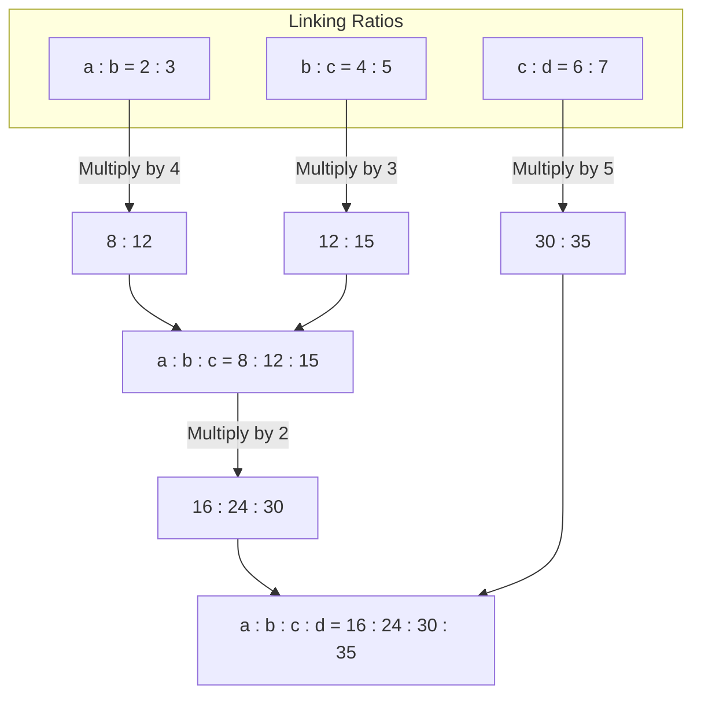

> [!theorem]
> **Bridging Principle (Common Variable Equalization)**
> To bridge two overlapping ratios $A : B$ and $B : C$, balance the shared variable $B$ using its Least Common Multiple $\operatorname{LCM}(B_1, B_2)$[cite: 1]:
> $$A : B = r_1 : r_2 \quad (\times r_3)$$[cite: 1]
> $$B : C = r_3 : r_4 \quad (\times r_2)$$[cite: 1]
> $$A : B : C = (r_1 \cdot r_3) : (r_2 \cdot r_3) : (r_2 \cdot r_4)$$[cite: 1]
> 
> **N-Chain Method (Extended Multi-Ratio)**:
> For $a:b$, $b:c$, $c:d$:
> - $a = a \times b_2 \times c_2$[cite: 1]
> - $b = b_1 \times b_2 \times c_2$[cite: 1]
> - $c = b_1 \times c_1 \times c_2$[cite: 1]
> - $d = b_1 \times c_1 \times d_2$[cite: 1]

> [!question]
> **Type 4: Three-Term Bridging**
> If $a : b = 2 : 3$ and $b : c = 4 : 5$, find $a : b : c$[cite: 1].
> - 1. $4 : 12 : 10$
> - 2. $8 : 12 : 15$
> - 3. $15 : 8 : 9$
> - 4. $3 : 6 : 7$[cite: 1]
> 
> *Solution:*
> Scale to make the shared term $b$ equal ($\operatorname{LCM}(3, 4) = 12$)[cite: 1]:
> $$a : b = 4 \times (2 : 3) = 8 : 12$$[cite: 1]
> $$b : c = 3 \times (4 : 5) = 12 : 15$$[cite: 1]
> Combining gives:
> $$a : b : c = 8 : 12 : 15$$[cite: 1]
> **Correct Option: 2**[cite: 1]

> [!question]
> **PYQ (AFCAT 2 2024): Direct Three-Term Bridge**
> If $a : b = 3 : 5$ and $b : c = 4 : 7$, find $a : b : c$[cite: 1].
> - 1. $12 : 20 : 35$
> - 2. $3 : 4 : 7$
> - 3. $12 : 10 : 15$
> - 4. None[cite: 1]
> 
> *Solution:*
> Balance $b$ across ratios ($\operatorname{LCM}(5, 4) = 20$):
> $$a : b = 4 \times (3 : 5) = 12 : 20$$
> $$b : c = 5 \times (4 : 7) = 20 : 35$$
> $$a : b : c = 12 : 20 : 35$$[cite: 1]
> **Correct Option: 1**[cite: 1]

> [!question]
> **Type 5: Four-Term Serial Chain**
> If $a : b = 2 : 3$, $b : c = 4 : 5$, and $c : d = 6 : 7$, find $a : b : c : d$[cite: 1].
> - 1. $16 : 24 : 30 : 35$
> - 2. $13 : 7 : 23 : 25$
> - 3. $10 : 15 : 16 : 13$
> - 4. $11 : 55 : 67 : 58$[cite: 1]
> 
> *Solution:*
> 1. Bridge $a : b$ and $b : c$:
>    $$a : b : c = 8 : 12 : 15$$[cite: 1]
> 2. Bridge $(a : b : c)$ with $c : d = 6 : 7$ on common term $c$ ($\operatorname{LCM}(15, 6) = 30$)[cite: 1]:
>    $$2 \times (8 : 12 : 15) = 16 : 24 : 30$$[cite: 1]
>    $$5 \times (6 : 7) = 30 : 35$$[cite: 1]
>    $$a : b : c : d = 16 : 24 : 30 : 35$$[cite: 1]
> **Correct Option: 1**[cite: 1]

> [!question]
> **PYQ (AFCAT 2 2024): Group Wages with Mixed Denominations**
> If $16\text{ Men}$, $18\text{ Women}$, and $30\text{ Boys}$ earn a total of Rs. $27400$[cite: 1], and the daily earning ratio of $1\text{ Man} : 1\text{ Woman} : 1\text{ Boy}$ is $10 : 3 : 2$[cite: 1], find how much an individual boy earns[cite: 1].
> - 1. $548$
> - 2. $274$
> - 3. $674$
> - 4. None[cite: 1]
> 
> *Solution:*
> Let the daily wage of $1\text{ man} = 10x$, $1\text{ woman} = 3x$, $1\text{ boy} = 2x$[cite: 1].
> Formulate the total wage equation:
> $$16(10x) + 18(3x) + 30(2x) = 27400$$[cite: 1]
> $$160x + 54x + 60x = 27400$$[cite: 1]
> $$274x = 27400 \implies x = 100$$[cite: 1]
> Earning of an individual boy:
> $$\text{Boy's Earning} = 2x = 2(100) = \text{Rs. } 200$$[cite: 1]
> Since $200$ is not listed in options 1, 2, or 3, select None[cite: 1].
> **Correct Option: 4 (None)**[cite: 1]

> [!question]
> **PYQ (AFCAT 2 2025): Five-Company Profit Bridging**
> Companies $C_1, C_2, C_3, C_4, C_5$ report profits[cite: 1]. The ratio of profits for $C_1 : C_2 : C_3 = 9 : 10 : 8$, while $C_2 : C_4 : C_5 = 18 : 19 : 20$[cite: 1]. If $C_5$ made Rs. $19\text{ crore}$ more profit than $C_1$, find the total profit made by all five companies[cite: 1].
> - 1. $530\text{ Cr}$
> - 2. $430\text{ Cr}$
> - 3. $438\text{ Cr}$
> - 4. None[cite: 1]
> 
> *Solution:*
> The common company is $C_2$. Balance values across ratios ($\operatorname{LCM}(10, 18) = 90$)[cite: 1]:
> $$9 \times (C_1 : C_2 : C_3 = 9 : 10 : 8) \implies 81 : 90 : 72$$[cite: 1]
> $$5 \times (C_2 : C_4 : C_5 = 18 : 19 : 20) \implies 90 : 95 : 100$$[cite: 1]
> Consolidated ratio:
> $$C_1 : C_2 : C_3 : C_4 : C_5 = 81 : 90 : 72 : 95 : 100$$[cite: 1]
> Given difference between $C_5$ and $C_1$:
> $$100x - 81x = 19x = 19\text{ crore} \implies x = 1\text{ crore}$$[cite: 1]
> Sum of all profit units:
> $$\text{Total} = (81 + 90 + 72 + 95 + 100)x = 438x = 438 \times 1\text{ crore} = \text{Rs. } 438\text{ crore}$$[cite: 1]
> **Correct Option: 3**[cite: 1]

> [!question]
> **PYQ (AFCAT 2 2024): Fractional Relative Shares**
> The share of $B$ is $\frac{2}{5}$ of $A$, and $B$'s share is also $\frac{7}{9}$ of $C$[cite: 1]. If the total sum is Rs. $67,000$, find the individual shares of $A, B,$ and $C$[cite: 1].
> - 1. $35000, 14000, 18000$
> - 2. $34000, 15000, 18000$
> - 3. $37000, 14000, 16000$
> - 4. None[cite: 1]
> 
> *Solution:*
> Express ratios with respect to $B$[cite: 1]:
> $$B = \frac{2}{5}A \implies \frac{A}{B} = \frac{5}{2} \implies A : B = 5 : 2$$[cite: 1]
> $$B = \frac{7}{9}C \implies \frac{B}{C} = \frac{7}{9} \implies B : C = 7 : 9$$[cite: 1]
> Balance shared term $B$ ($\operatorname{LCM}(2, 7) = 14$)[cite: 1]:
> $$7 \times (A : B = 5 : 2) = 35 : 14$$[cite: 1]
> $$2 \times (B : C = 7 : 9) = 14 : 18$$[cite: 1]
> Consolidated ratio:
> $$A : B : C = 35 : 14 : 18 \quad (\text{Total units} = 35 + 14 + 18 = 67)$$[cite: 1]
> Compute individual shares[cite: 1]:
> $$A = \frac{35}{67} \times 67000 = \text{Rs. } 35000$$[cite: 1]
> $$B = \frac{14}{67} \times 67000 = \text{Rs. } 14000$$[cite: 1]
> $$C = \frac{18}{67} \times 67000 = \text{Rs. } 18000$$[cite: 1]
> **Correct Option: 1**[cite: 1]
