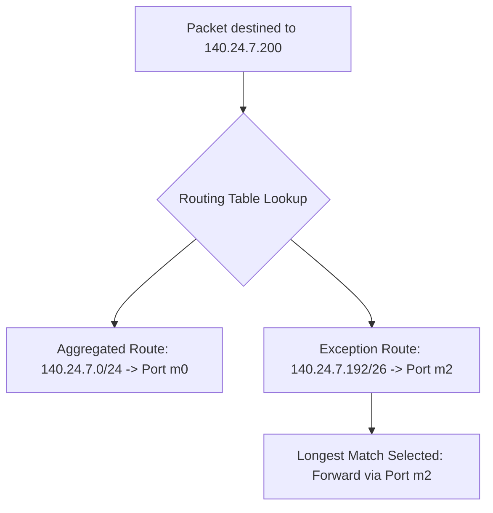

> [!theorem] Exception Handling via Longest Prefix Matching
> Supernetting allows aggregating an entire network block into a broad prefix while retaining individual, highly-specific entries for exception routes pointing to alternate interfaces[cite: 1].
> * The more specific exception entry automatically overrides the aggregated entry for matching packets due to Longest Prefix Matching[cite: 1].

> [!question] Forwarding Table Minimization Problem
> Router $R_2$ connects to:
> * `140.24.7.0/26` on interface $m_0$[cite: 1]
> * `140.24.7.64/26` on interface $m_0$[cite: 1]
> * `140.24.7.128/26` on interface $m_0$[cite: 1]
> * `140.24.7.192/26` on interface $m_2$[cite: 1]
> * Default route on interface $m_1$[cite: 1]
> 
> How can $R_2$'s routing table be minimized without misrouting packets[cite: 1]?

### Resolution

1. Aggregate all four $/26$ subnets into `140.24.7.0/24` pointing to interface $m_0$[cite: 1].
2. Add an explicit exception entry for `140.24.7.192/26` pointing to interface $m_2$[cite: 1].
3. The resulting optimized table contains:
   * `140.24.7.0/24` $\longrightarrow m_0$[cite: 1]
   * `140.24.7.192/26` $\longrightarrow m_2$[cite: 1]
   * `Default` $\longrightarrow m_1$[cite: 1]
4. When a packet for `140.24.7.200` arrives, it matches both $/24$ and $/26$[cite: 1]. Because $/26$ is longer, the router forwards it to interface $m_2$, preserving correct routing behavior[cite: 1].
