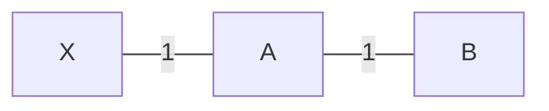

### The Count-to-Infinity Problem
A major weakness of Distance Vector Routing is slow convergence when handling link failures. The common rule of thumb is: *"Good news travels fast, bad news travels slow"*.

* Initial state: Node A reaches X with cost $1$. Node B reaches X through A with cost $2$.
* The link between X and A fails.
* Node A immediately detects the failure and sets its distance to X as $\infty$.
* Before A can broadcast this update, B sends its periodic advertisement: *"I can reach X with cost 2"*.
* Node A receives B's update and assumes B has an alternate route to X. A updates its cost:
  $$D_A(X) = c(A, B) + D_B(X) = 1 + 2 = 3$$
* In the next round, A advertises $D_A(X) = 3$ to B. B updates its cost:
  $$D_B(X) = c(B, A) + D_A(X) = 1 + 3 = 4$$
* A and B continue incrementing their advertised costs in a two-node routing loop until both values reach the defined infinity threshold (e.g., $16$ in RIP).

### Mitigation Techniques
A router’s "horizon" is the full landscape of reachable routes it can see and advertise out its interfaces.
That horizon is **"split"** because the router presents two completely different views: it announces the route forward to all other links, but splits that perspective by hiding (or poisoning) that exact destination when looking back at the neighbor it learned it from.

#### 1. Split Horizon
> [!theorem] Split Horizon Rule
> A router never advertises a route back out the same interface through which it learned that route.
> * If B routes traffic to X via A, B does not advertise a route to X back to A.

#### 2. Split Horizon with Poison Reverse
> [!theorem] Poison Reverse Rule
> Instead of omitting the route, the router advertises the route back to the source with an infinite cost ($\infty$).
> * Node B explicitly advertises $D_B(X) = \infty$ to A. This immediately breaks the two-node loop if the link between X and A fails.

> [!trap] Multi-Node Instability Failure
> Split Horizon and Poison Reverse resolve **two-node routing loops**, but they **cannot prevent multi-node loops** (loops involving three or more nodes).
