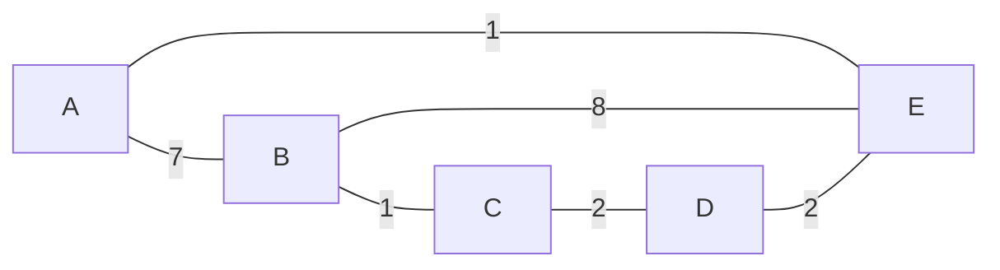

### Sample Network Topology
Consider a 5-node network with links and associated costs:

### Initial State (Round 0)
Each router knows only the direct link costs to its immediate neighbors:

|  Node Table   |         A         |         B         |         C         |         D         |         E         |
| :-----------: | :---------------: | :---------------: | :---------------: | :---------------: | :---------------: |
| **At Node A** |   $0$    |   $7$    | $\infty$ | $\infty$ |   $1$    |
| **At Node B** |   $7$    |   $0$    |   $1$    | $\infty$ |   $8$    |
| **At Node C** | $\infty$ |   $1$    |   $0$    |   $2$    | $\infty$ |
| **At Node D** | $\infty$ | $\infty$ |   $2$    |   $0$    |   $2$    |
| **At Node E** |   $1$    |   $8$    | $\infty$ |   $2$    |   $0$    |

### Update at Node A (Round 1)
Router A receives vectors from its neighbors B and E:
* Destination A: $\min(0, 7+7, 1+1) = 0$
* Destination B: $\min(7, 7+0, 1+8) = 7$ (via B)
* Destination C: $\min(\infty, c(A, B) + D_B(C), c(A, E) + D_E(C)) = \min(\infty, 7+1, 1+\infty) = 8$ (via B)
* Destination D: $\min(\infty, c(A, B) + D_B(D), c(A, E) + D_E(D)) = \min(\infty, 7+\infty, 1+2) = 3$ (via E)
* Destination E: $\min(1, 7+8, 1+0) = 1$ (via E)

Node A's updated vector becomes: `[0, 7, 8, 3, 1]`.

### Full Network Vectors After Round 1

| Node Table | A | B | C | D | E |
| :---: | :---: | :---: | :---: | :---: | :---: |
| **At Node A** | $0$ | $7$ | $8$ | $3$ | $1$ |
| **At Node B** | $7$ | $0$ | $1$ | $3$ | $8$ |
| **At Node C** | $8$ | $1$ | $0$ | $2$ | $4$ |
| **At Node D** | $3$ | $3$ | $2$ | $0$ | $2$ |
| **At Node E** | $1$ | $8$ | $4$ | $2$ | $0$ |

Subsequent rounds evaluate paths across more hops until all routing vectors converge.
