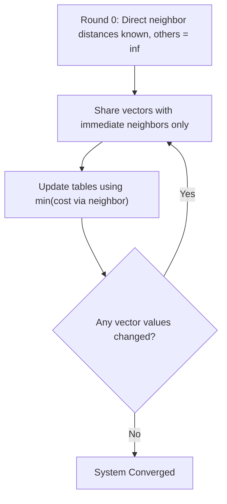

Distance Vector Routing (DVR) is a dynamic, decentralized routing algorithm based on the distributed Bellman-Ford shortest-path algorithm[cite: 1].

### Operational Principles
1. Each router maintains a routing vector (distance vector) containing the minimum known distance to every other node in the network, along with the designated next-hop neighbor to reach it[cite: 1].
2. Routers initially know only the link costs to their directly connected immediate neighbors[cite: 1]. Distances to all other destinations are initialized to infinity ($\infty$)[cite: 1].
3. Periodically—and whenever a local link cost changes—each router sends a copy of its distance vector to its directly connected neighbors[cite: 1].

> [!formula] Distance Vector Update Equation (Bellman-Ford)
> When router $x$ receives a vector advertisement from neighbor $v$, it updates its cost to destination $y$ via:
> $$D_x(y) = \min \Big\{ D_x(y), \, c(x, v) + D_v(y) \Big\}$$[cite: 1]
> Where $c(x, v)$ is the direct link cost from $x$ to $v$, and $D_v(y)$ is the cost advertised by $v$ to reach $y$[cite: 1].

### Convergence Rate
In a network containing $N$ nodes, the algorithm converges in at most $N-1$ exchange rounds[cite: 1]. More precisely, if the longest shortest path between any two nodes contains $k$ hops, the network requires $k$ update iterations to converge[cite: 1].

