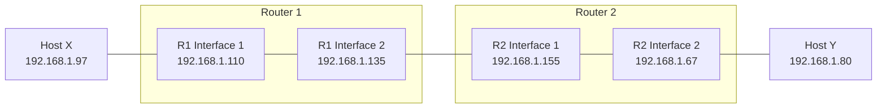

## 1. Fundamental Rules (The Core Invariants)

1. **One Interface = One Subnet:** Every active interface (port) on a router connects to a completely separate, independent IP subnet.
2. **Subnet Isolation:** A single physical interface cannot belong to two different subnets simultaneously (unless virtual sub-interfaces/VLAN tagging are used).
3. **The Gateway Rule:** A host and its Default Gateway **MUST** belong to the exact same subnet range.

> [!TIP] Intuition
> Think of a router as a door between different rooms (subnets). To step out of your room (Host $X$), you must use the door located inside your room (Router Interface $R_1\text{-Int}1$).

---

## 2. Network Topology

---

## 3. Practice Problem: GATE CS 2022

### Problem Statement
* **Host X IP:** `192.168.1.97`
* **Host Y IP:** `192.168.1.80`
* **Router $R_1$ IPs:** `192.168.1.110` and `192.168.1.135`
* **Router $R_2$ IPs:** `192.168.1.67` and `192.168.1.155`
* **Subnet Mask:** `255.255.255.224` (or `/27` in CIDR notation)

**Question:** Which IP address must Host $X$ configure as its **Default Gateway**?

---

### Step-by-Step Solution

#### Step 1: Calculate Block Size (Subnet Size)
For a `/27` network mask:
$$\text{Host Bits} = 32 - 27 = 5 \text{ bits}$$
$$\text{Block Size} = 2^5 = 32 \text{ IP addresses per subnet}$$

#### Step 2: Determine Host $X$'s Subnet Range
To find the start (Network ID) of Host $X$'s subnet (`192.168.1.97`):

$$\text{Subnet Number} = \left\lfloor \frac{97}{32} \right\rfloor = 3$$
$$\text{Network ID} = 3 \times 32 = 96$$

* **Subnet Start (Network ID):** `192.168.1.96`
* **Subnet End (Broadcast ID):** `96 + 32 - 1 = 127`
* **Valid Host Range:** `192.168.1.96` to `192.168.1.127`

#### Step 3: Match Host $X$ with Router $R_1$'s Interfaces
Since Host $X$ is physically connected to Router $R_1$, its gateway must be one of $R_1$'s two interface IPs:

| $R_1$ Interface IP | Belongs to Subnet Range? | Status |
| :--- | :--- | :--- |
| `192.168.1.110` | $[96, 127]$ | **VALID** (Same subnet as Host X) |
| `192.168.1.135` | $[128, 159]$ | **INVALID** (Different subnet) |

---

 **Final Answer**
**Host $X$ must configure `192.168.1.110` as its default gateway.**

**---**
