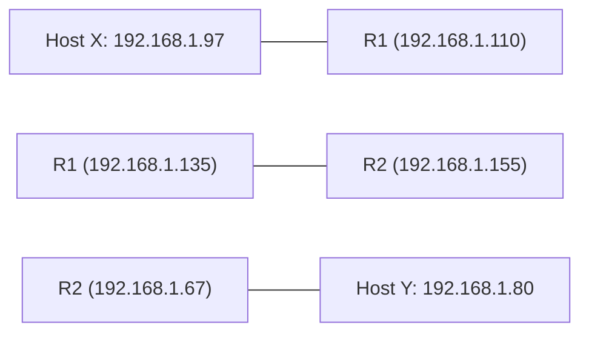

> [!theorem] The Router Interface Subnet Invariant
> 1. Every distinct physical or logical routed interface on a router defines an independent IP subnet[cite: 1].
> 2. A single router interface cannot belong to two different subnets simultaneously without virtual tagging (VLANs)[cite: 1].
> 3. To find the total minimum number of subnets guaranteed to exist in a multi-router internetwork, count the total number of connected interfaces across all routers minus shared point-to-point links[cite: 1].

> [!question] GATE CS 2022: Gateway Configuration Analysis
> Host $X$ has IP `192.168.1.97` and connects through routers $R_1$ and $R_2$ to host $Y$ (`192.168.1.80`)[cite: 1].
> * Router $R_1$ interfaces have IPs: `192.168.1.135` and `192.168.1.110`[cite: 1].
> * Router $R_2$ interfaces have IPs: `192.168.1.67` and `192.168.1.155`[cite: 1].
> * Subnet mask across the system is `255.255.255.224` ($/27$)[cite: 1].
> 
> Which IP address must Host $X$ configure as its default gateway[cite: 1]?

### Analytical Solution

* Subnet mask: `255.255.255.224` ($/27 \implies \text{Block Size} = 2^{32-27} = 32$)[cite: 1].
* Subnet boundary calculation for Host $X$ (`192.168.1.97`):
  $$\left\lfloor \frac{97}{32} \right\rfloor \times 32 = 3 \times 32 = 96$$[cite: 1]
  * Network range for Host $X$: `192.168.1.96` to `192.168.1.127`[cite: 1].
* Invariant: A host and its default gateway must belong to the exact same subnet[cite: 1].
* Evaluating $R_1$'s interface addresses:
  * `192.168.1.110` lies inside $[96, 127]$[cite: 1].
  * `192.168.1.135` belongs to subnet $[128, 159]$[cite: 1].
* Host $X$ must configure **`192.168.1.110`** as its default gateway[cite: 1].
