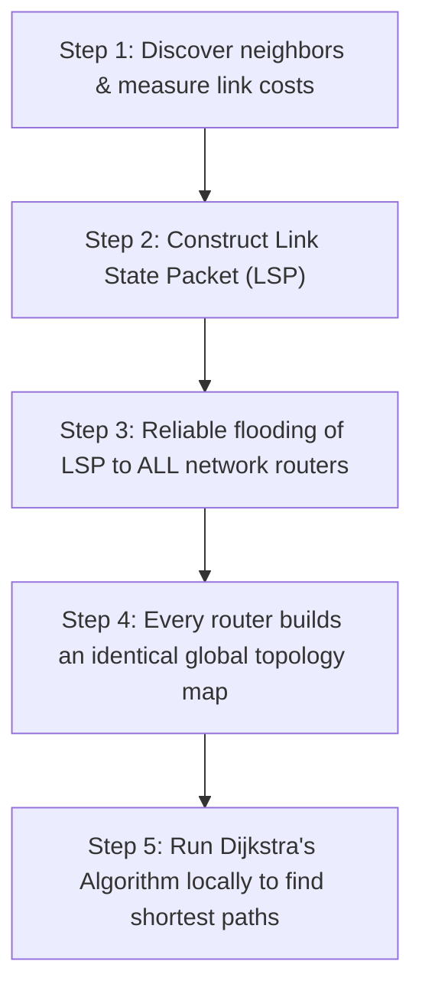

Due to slow convergence and loop vulnerability in Distance Vector protocols, the ARPANET transitioned in 1979 to Link State Routing (LSR).

### Operational Principles
1. **Global Information Sharing**: Every router floods the state of its immediate links to **every other router in the entire network**.
2. **Shortest Path Computation**: Once flooding completes, each router possesses an identical global map of the network topology. Each node then runs Dijkstra's algorithm independently to construct its forwarding table.

### Link State Packet (LSP) Structure
Imagine a cluster of tropical islands. You live on one island, and you keep all your friend-island chiefs updated by sending carrier birds with little rolled-up letters (LSPs):
- **Node ID $\to$ Your Island's Seal & Signature:** Tells everyone which island chief authored the note so they know who they're talking about.
- **Direct Neighbors & Costs $\to$ Island Bridges & Distances:** A quick list stating: _"I have a rope bridge to Bob's island ($2$ miles) and a canoe path to Charlie's ($5$ miles)."_
- **Sequence Number $\to$ The Bird's Letter Edition (#):** A counter (#1, #2, #3...). If a bird arrives late carrying letter #2, but another bird already brought letter #3, the chief throws letter #2 in the fire because it's outdated gossip.
- **Age / TTL $\to$ The Note's Expiration Stamp:** A countdown timer. If a letter gets stuck in a bird's feathers or the edition number gets ink-stained/corrupted by a rogue seagull, this timer counts down to zero so stale letters are eventually burned instead of lingering forever.
### Comparing Routing Strategies

| Metric / Property            | Distance Vector Routing (DVR)                         | Link State Routing (LSR)                                       |
| :--------------------------- | :---------------------------------------------------- | :------------------------------------------------------------- |
| **Information Disseminated** | Complete routing vector (destinations and distances). | Local link costs to immediate neighbors only.                  |
| **Communication Scope**      | Exchanged with **immediate neighbors only**.          | Flooded to **every router in the network**.                    |
| **Convergence Time**         | Slower; can suffer from Count-to-Infinity.            | Fast; converges once LSP flooding finishes.                    |
| **Computational Overhead**   | Low CPU load (incremental Bellman-Ford).              | Higher CPU and memory load (Dijkstra's across the global map). |
| **Representative Protocol**  | RIP (Routing Information Protocol)                    | OSPF (Open Shortest Path First)                                |

**The "Rumor" Anchor:** Distance vector is famously called _"routing by rumor"_—and rumors lead to gossip, panic, and people ending up **RIP**.