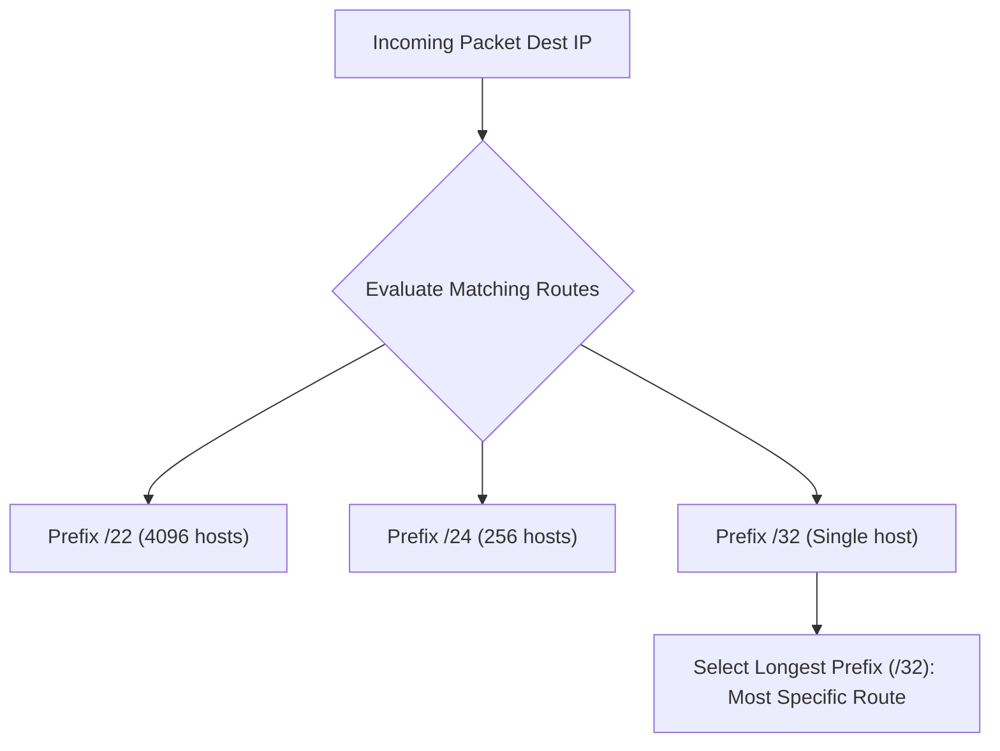

> [!definition] Longest Prefix Match (LPM)
> When a packet arrives at a router, the router examines its forwarding table and may find multiple route entries matching the packet's destination IP address[cite: 1].
> * The **Longest Prefix Matching Rule** dictates that the router must forward the packet using the matching entry that has the **longest prefix length (highest number of prefix mask bits)**[cite: 1].
> * The longest prefix corresponds to the smallest, most specific destination network[cite: 1].

> [!question] LPM Route Lookup Trace
> Given the routing table[cite: 1]:
> 
> | Destination Prefix | Next Hop / Interface |
> | :--- | :--- |
> | `192.15.7.0/24`[cite: 1] | Port 1[cite: 1] |
> | `192.15.7.0/26`[cite: 1] | Port 2[cite: 1] |
> | `192.15.7.3/32`[cite: 1] | Port 3[cite: 1] |
> | `Default` (`0.0.0.0/0`)[cite: 1] | Port 4[cite: 1] |
> 
> Determine the output port for[cite: 1]:
> 1. `192.15.7.3`[cite: 1]
> 2. `192.15.7.4`[cite: 1]
> 3. `192.14.13.12`[cite: 1]
> 4. `192.14.6.255`[cite: 1]

### Lookup Trace

1. `192.15.7.3`: Matches $/24$, $/26$, $/32$, and Default. The longest prefix is $/32 \implies \mathbf{\text{Port 3}}$[cite: 1].
2. `192.15.7.4`: Matches $/24$, $/26$ (since $4 \le 63$), and Default. Longest prefix is $/26 \implies \mathbf{\text{Port 2}}$[cite: 1].
3. `192.14.13.12`: Does not match any `192.15.x.x` route; matches only Default $\implies \mathbf{\text{Port 4}}$[cite: 1].
4. `192.14.6.255`: Matches only Default $\implies \mathbf{\text{Port 4}}$[cite: 1].
