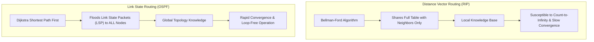

> [!definition]
> **Routing Algorithms** dynamically build routing tables to direct IP packets across interconnected networks[cite: 2].
> - **Distance Vector Routing (DVR):** Distributed Bellman-Ford algorithm where each router shares its full routing table exclusively with immediate physical neighbors[cite: 1, 2].
> - **Link State Routing (LSR):** Dijkstra-based algorithm where each router floods the operational state of its directly attached links to all routers in the autonomous system[cite: 1, 2].

| Parameter | Distance Vector Routing (DVR) | Link State Routing (LSR) |
| :--- | :--- | :--- |
| **Mathematical Basis** | Bellman-Ford Algorithm[cite: 1, 2] | Dijkstra's Shortest Path First (SPF)[cite: 1, 2] |
| **Knowledge Distribution** | Local topology; full table to direct neighbors[cite: 2] | Global topology; link state flooded to all nodes[cite: 2] |
| **Convergence Speed** | Very slow (vulnerable to persistent routing loops)[cite: 1, 2] | Rapid / Fast convergence[cite: 2] |
| **Loop Vulnerability** | **Count-to-Infinity Problem**[cite: 1, 2] | Transient loops only during re-computation[cite: 2] |
| **Representative Protocol**| **RIP** (Routing Information Protocol)[cite: 1, 2] | **OSPF** (Open Shortest Path First)[cite: 1, 2] |
| **Transport Layer Carrier**| Runs over **UDP Port 520**[cite: 2] | Runs directly over **IP (Protocol 89)** |
| **Hop Count Limit** | Max 15 hops; $\text{Metric} = 16$ means $\infty$ (Unreachable)[cite: 1, 2] | No metric-based hop limitation (uses link cost) |

> [!theorem]
> **Count-to-Infinity Invariant:**  
> The Count-to-Infinity anomaly in DVR arises because routers update path vectors based on incomplete, secondhand topology reports from neighboring nodes[cite: 1]. When a link fails, mutual dependency creates recursive path updates where metric increments continue until hitting the administrative infinity ceiling ($\text{RIP} = 16$)[cite: 1, 2].

> [!trap]
> Never mix up the shortest-path algorithms across subjects:
> - **DVR** uses **Bellman-Ford**[cite: 1, 2].
> - **LSR** uses **Dijkstra**[cite: 1, 2].
> - **Floyd-Warshall** is an All-Pairs Shortest Path algorithm ($O(V^3)$), not used in standard dynamic link-state routing[cite: 1].
> - **Prim's / Kruskal's** find a Minimum Spanning Tree (MST), not shortest routing paths[cite: 1].

> [!question]
> **Q:** In Distance Vector Routing using RIP, what is the primary root cause of the "Count-to-Infinity" anomaly?  
> (A) Hardware failure of intermediate Layer-2 switches  
> (B) Routing loops caused by slow convergence and inconsistent updates following a link failure  
> (C) High packet drop rate due to MTU mismatches  
> (D) Asymmetric propagation delays on duplex links  
>
> **Answer:** **(B)**[cite: 1]  
> **Explanation:**  
> When a link breaks, distant routers continue advertising outdated routing entries to their neighbors[cite: 1]. Because DVR convergence is slow, these inconsistent routing metrics cycle in a loop, incrementally counting up to infinity[cite: 1, 2].
