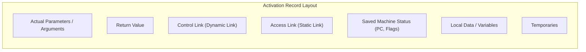

> [!definition]
> - **Activation Record (Stack Frame)**: A contiguous block of memory allocated when a procedure is called, holding dynamic runtime state.
> - **Activation Tree**: A tree representing the procedural nesting and invocation lifespan of a program run; paths correspond to stack operations.

| Memory Segment | Growth Direction | Lifetime / Allocation Policy | Typical Contents |
| :--- | :--- | :--- | :--- |
| **Code Segment** | Static / Fixed | Program lifetime; read-only | Compiled machine instructions |
| **Static Data** | Static / Fixed | Program lifetime; compile-time bound | Global and static variables |
| **Heap** | Dynamic (Grows Upwards toward Stack) | Dynamic allocations (`malloc`, `new`); manual or GC freed | Dynamically allocated objects, linked structures |
| **Stack** | Dynamic (Grows Downwards toward Heap) | Call-to-return lifespan (LIFO) | Activation records, local variables, return addresses |

> [!theorem]
> **Parameter Passing Mechanisms**:
> 1. **Call by Value**: Caller passes copies of actual arguments. Callee modifications stay local; the caller's variables remain unchanged.
> 2. **Call by Reference**: Caller passes the memory addresses (pointers) of actual arguments. Any assignment by the callee mutates the caller's variables directly.
> 3. **Call by Copy-Restore (Value-Result)**: Actuals are evaluated and copied into local formal variables on entry. On return, the final values of the formals are copied back into the actual variables.
> 4. **Call by Name**: Algol-60 textual substitution (Thunks). The argument expression is re-evaluated in the caller's environment every single time it is referenced.

> [!trap]
> **Static vs Dynamic Links**:
> - **Control (Dynamic) Link**: Points to the caller's activation record (execution stack path).
> - **Access (Static) Link**: Points to the activation record of the compile-time enclosing lexical scope, enabling access to non-local variables.

> [!question]
> In a procedural programming language with nested functions, non-local variables in enclosing lexical scopes are accessed at runtime using:
> - (A) Dynamic Links (Control Links)
> - (B) Static Links (Access Links)
> - (C) Stack Pointer ($SP$) offset directly
> - (D) Program Counter relative addressing
>
> **Correct Option**: **(B)**
> **Explanation**: The Static (Access) Link connects an activation record to the activation record of its static/lexical parent. Dynamic Links track the execution caller chain.
