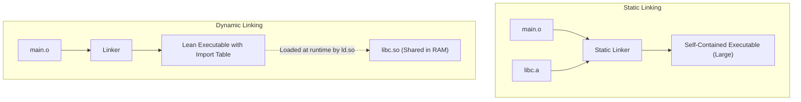
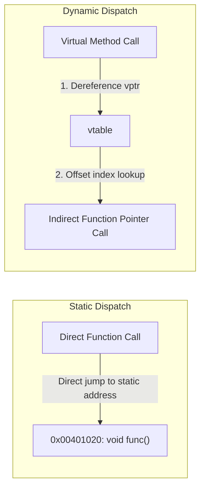

> [!definition]
> **Linking and Dispatch** describe how symbols (functions, routines, and external modules) are mapped to executable code blocks:
> * **Static Linking:** External routines and archive libraries (`.a`, `.lib`) are copied directly into the final binary executable at build time.
> * **Dynamic Linking:** The binary contains only import stub tables. The operating system loader or dynamic linker (`ld.so`) maps shared libraries (`.so`, `.dll`) into the process address space during program startup or at runtime via API calls (`dlopen`).

### Dispatch Paradigms

### Comprehensive Comparison: Static vs Dynamic Linking

| Parameter | Static Linking / Static Dispatch | Dynamic Linking / Dynamic Dispatch |
| :--- | :--- | :--- |
| **Resolution Target** | Absolute memory address or relative fixed PC offset | Indirection table: Global Offset Table (GOT) / `vtable` |
| **Memory Utilization** | High disk footprint; code duplicated across processes | Low physical memory; shared pages across multiple processes |
| **Execution Performance**| Optimal speed; allows compiler cross-function inlining | Indirection overhead; potential dynamic linker resolution latency |
| **Hot Patching / Updates**| Requires full recompilation and relinking of application | Allows drop-in updates of shared objects without recompiling host binary |

> [!question]
> **Practice Problem:** Why does dynamic dispatch prevent typical compiler function inlining optimizations?
>
> **Analysis:**
> Inlining requires the compiler to replace a function invocation instruction with the exact body of the callee at compile time. Because dynamic dispatch depends on the runtime value of the object's `vptr` (which can change based on conditional branch logic, polymorphism, or user input), the static compiler cannot definitively identify the target method implementation, forcing an indirect call instruction.
