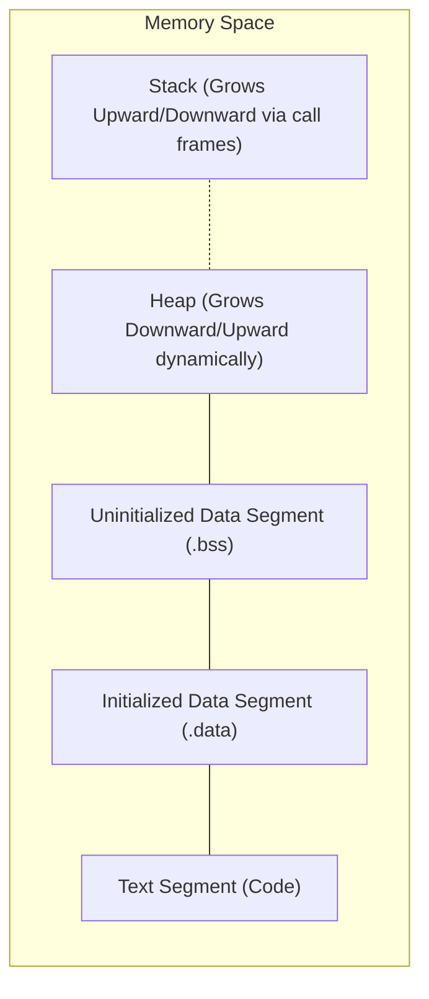

> [!definition]
> **Memory Allocation** defines how and when storage is mapped to variables during the execution lifecycle:
> * **Static Memory Allocation:** Storage is reserved in the compiled binary image before execution starts (in `.data` and `.bss` segments). Addresses are fixed at compile/link time and persist throughout program execution.
> * **Dynamic Memory Allocation:** Storage is requested from the operating system kernel at runtime from the **Heap** segment via system calls (`brk`, `sbrk`, `mmap`) or managed runtimes (Garbage Collectors).

### Allocation Classifications

| Segment | Allocation Mechanism | Lifetime | Binding Time |
| :--- | :--- | :--- | :--- |
| **`.data` / `.bss`** | Static allocation | Entire program run | Compile / Link time |
| **Stack** | Automatic allocation (`auto`) | Scope entry to exit | Runtime (frame push/pop) |
| **Heap** | Dynamic allocation (`malloc`/`new`) | Explicit free / GC collection | Runtime (allocator search) |

> [!theorem]
> **Fragmentation Theorem in Dynamic Memory:**
> Under arbitrary dynamic allocation and deallocation sequences of variable block sizes, external fragmentation can render an allocation of size $S$ impossible even if total free heap space $\sum s_i \gg S$, because no single contiguous block satisfies $s_k \ge S$. Static allocation completely eliminates runtime fragmentation at the cost of rigid data capacities.

> [!trap]
> In C, the `static` keyword modifies **lifetime and linkage**, not scope:
> 1. Inside a function: Changes storage duration from automatic (stack) to static (`.data`/`.bss`), but the identifier remains lexically visible **only** inside that function block.
> 2. Outside a function: Restricts identifier linkage to internal linkage (the translation unit), keeping static allocation unchanged.
