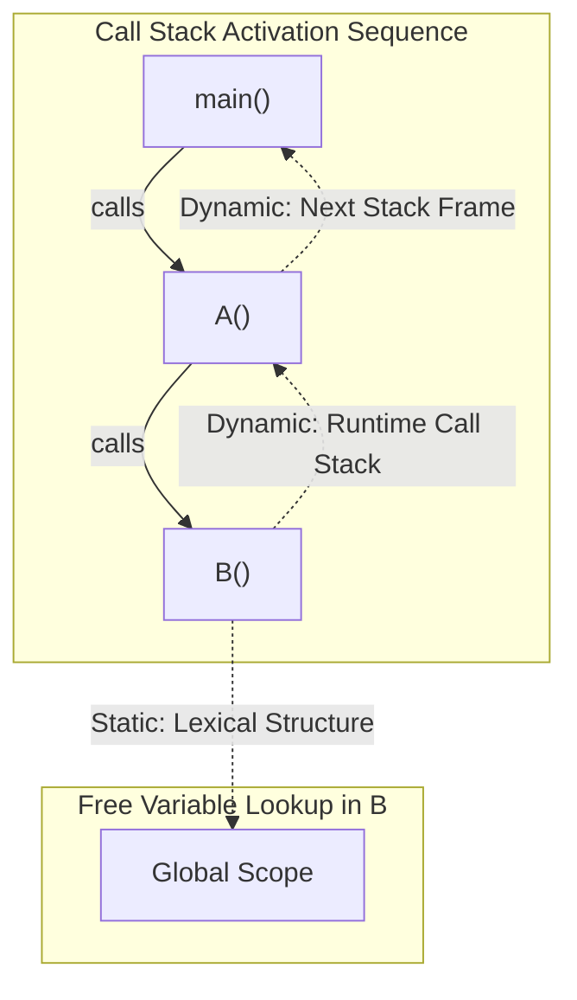

> [!definition]
> **Scoping** defines the spatial region of program text where an identifier is legally accessible and mapped to a distinct memory entity.
> * **Static (Lexical) Scoping:** Variable lookup is governed strictly by the nested syntactic blocks `{ ... }` of the source code. The identifier's binding is fully determined by the compiler's symbol table hierarchy.
> * **Dynamic Scoping:** Variable lookup traverses the sequence of active activation records (frames) along the runtime call stack, binding an undeclared identifier to the most recently executed frame in the call chain.



### Comparative Analysis: Static vs Dynamic Scope

| Property | Static (Lexical) Scoping | Dynamic Scoping |
| :--- | :--- | :--- |
| **Resolution Phase** | Translation / Compile-time | Runtime activation inspection |
| **Reference Determinism** | Independent of caller sequence | Highly dependent on caller execution path |
| **Representative Languages**| C, C++, Java, Python, JavaScript | Classic Lisp, Bash, Perl (`local`), TeX |
| **Compiler Optimization** | Registers/offsets bound at compile time | Requires symbol lookup or dynamic display vectors |

> [!trap]
> In C and C++, `auto` stack-allocated variables have **dynamic lifetime (storage duration)**, but their scope is strictly **static (lexical)**. Function `B()` invoked by function `A()` cannot reference `A`'s local stack variables by name; the C compiler throws an undeclared identifier error at compile time.

> [!question]
> Trace the output of the following pseudocode under (i) Static Scoping and (ii) Dynamic Scoping:
>
> ```text
> integer x = 10, y = 20;
> 
> procedure B() {
>     write(x, y);
> }
> 
> procedure A() {
>     integer x = 100;
>     B();
> }
> 
> procedure main() {
>     integer y = 200;
>     A();
> }
> ```
>
> **Step-by-Step Resolution:**
> 1. **Static Scoping:** Procedure `B` has no local declarations for `x` or `y`. Its enclosing lexical environment is the global file scope. It references global `x = 10` and global `y = 20`. 
>    $$\text{Static Output: } 10, 20$$
> 2. **Dynamic Scoping:** Execution call stack: `main()` $\rightarrow$ `A()` $\rightarrow$ `B()`.
>    * `B()` checks its own frame: neither `x` nor `y` found.
>    * `B()` inspects caller `A()`'s frame: finds local `x = 100`. `y` is not declared in `A()`.
>    * `B()` inspects caller `main()`'s frame: finds local `y = 200`.
>    $$\text{Dynamic Output: } 100, 200$$
