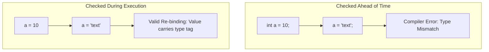

> [!definition]
> A **Type System** enforces constraints on operations applied to data.
> * **Static Typing:** Type checking occurs at compile-time. Every variable and expression is associated with an immutable type signature before execution.
> * **Dynamic Typing:** Type checking is deferred to runtime. Types are associated with runtime values (objects in memory) rather than variable storage identifiers.



### Orthogonal Axis: Static/Dynamic vs Strong/Weak

Typing discipline must not conflate type checking phase with type strictness:

| | Strong Typing (No implicit type coercion) | Weak Typing (Permissive implicit type conversion) |
| :--- | :--- | :--- |
| **Static Typing** | Java, Rust, Haskell, C# | C, C++ (implicit pointer casts, `void*`) |
| **Dynamic Typing** | Python, Ruby | JavaScript (`"5" - 2 = 3`), PHP |

> [!formula]
> Memory layout of a Dynamically Typed Object (e.g., Python `PyObject`):
> $$\text{Size}(\text{Dynamic Value}) = \text{Size}(\text{Reference Count}) + \text{Size}(\text{Type Tag Pointer}) + \text{Size}(\text{Payload})$$
> In contrast, a primitive type under static typing occupies purely its native payload:
> $$\text{Size}(\text{int32 in C}) = 4 \text{ bytes}$$

> [!trap]
> "Type Inference" (e.g., `auto` in C++, `val` in Kotlin, `var` in Go) is **not** dynamic typing. The compiler infers the concrete static type during compilation based on the initialization expression:
> 
> ```cpp
> auto x = 10; // Statically typed as int at compile time
> x = "gate";  // COMPILE ERROR: Cannot assign const char* to int
> ```
