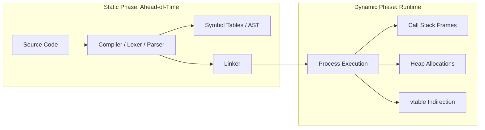

> [!definition]
> The dichotomy between **Static** and **Dynamic** in computer systems defines the binding phase of program properties:
> * **Static Properties:** Bound and enforced ahead-of-time (at translation, compilation, or link time) without executing machine instructions. Resolution depends entirely on the program text and formal grammar.
> * **Dynamic Properties:** Bound and evaluated at runtime based on the execution state, physical activation call stack, heap contents, and nondeterministic input data.

### Comprehensive Taxonomy Across Computer Science

| Domain | Static Mechanism | Dynamic Mechanism | Fundamental Tradeoff |
| :--- | :--- | :--- | :--- |
| **Scope Resolution** | Lexical Scoping (text blocks) | Dynamic Scoping (call stack chain) | Predictability vs. Contextual Flexibility |
| **Type Systems** | Static Typing (type checking at compile time) | Dynamic Typing (type tags stored in values) | Safety & Speed vs. Expressiveness |
| **Memory Allocation** | Static/BSS segment allocation | Heap allocation via system calls (`brk`/`mmap`) | Determinism vs. Adaptability |
| **Dispatch / Linking** | Early binding & Static linking | Late binding (`vtable`) & Shared libraries (`.so`) | Optimization/Portability vs. Modularity |
| **Program Analysis** | Static Analysis (AST verification, Linters) | Dynamic Analysis (Profilers, Valgrind, ASan) | Path Coverage vs. Concrete Precision |

> [!theorem]
> **Static Guarantee Invariant:**
> A statically checked property holds true for all possible execution paths without running the program. A dynamically verified property guarantees correctness only for the specific paths traversed by the given runtime input.
