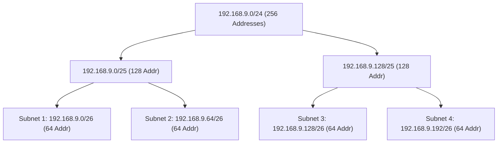

> [!definition] Subnetting
> The process of borrowing bits from the host portion of an allocated IP network block to create smaller internal sub-networks (subnets), forming additional levels of routing hierarchy within an organization[cite: 1].

> [!question] Equal Partitioning Walkthrough
> Divide the block `192.168.9.0/24` into $4$ equal subnets[cite: 1].
> 
> * Original block has $32 - 24 = 8$ host bits ($2^8 = 256$ total addresses)[cite: 1].
> * To form $4 = 2^2$ subnets, borrow $2$ bits from the host field[cite: 1]:
>   $$\text{New Prefix Length} = 24 + 2 = 26\text{ bits}$$[cite: 1]
> * Remaining host bits $= 8 - 2 = 6\text{ bits} \implies 2^6 = 64$ addresses per subnet[cite: 1].
> 
> | Subnet | 2 Subnet Bits | Range in 4th Octet | Subnet Network CIDR |
> | :--- | :--- | :--- | :--- |
> | **Subnet 1** | `00`[cite: 1] | $0 - 63$[cite: 1] | `192.168.9.0/26`[cite: 1] |
> | **Subnet 2** | `01`[cite: 1] | $64 - 127$[cite: 1] | `192.168.9.64/26`[cite: 1] |
> | **Subnet 3** | `10`[cite: 1] | $128 - 191$[cite: 1] | `192.168.9.128/26`[cite: 1] |
> | **Subnet 4** | `11`[cite: 1] | $192 - 255$[cite: 1] | `192.168.9.192/26`[cite: 1] |

---

> [!question] Splitting for Fixed Host Capacities
> Partition `192.168.9.0/24` into subnets such that each subnet can host at least $10$ hosts[cite: 1].
> 
> * For $10$ usable hosts: $2^h - 2 \ge 10 \implies 2^h \ge 12 \implies h = 4\text{ host bits}$[cite: 1].
> * Block size per subnet $= 2^4 = 16$ addresses[cite: 1].
> * Subnet bits borrowed $= 8 - 4 = 4\text{ bits}$, allowing $2^4 = 16$ distinct subnets[cite: 1]:
>   * Subnet 0: `192.168.9.0000xxxx` $\implies$ `192.168.9.0/28`[cite: 1]
>   * Subnet 1: `192.168.9.0001xxxx` $\implies$ `192.168.9.16/28`[cite: 1]
>   * $\dots$
>   * Subnet 15: `192.168.9.1111xxxx` $\implies$ `192.168.9.240/28`[cite: 1]
