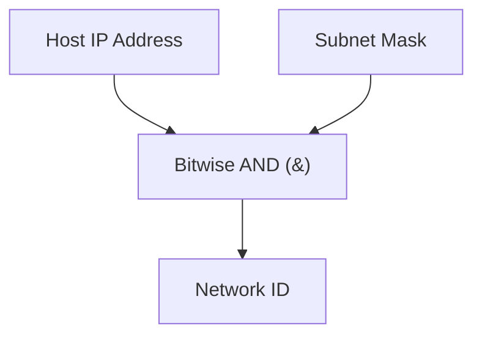

> [!definition] Subnet Mask
> A $32$-bit number consisting of a contiguous sequence of `1`s for all network/subnet prefix bits, followed by `0`s for all host bits[cite: 1].
> * Provides a hardware-friendly way to isolate the Network ID via bitwise operations[cite: 1].

> [!theorem] Subnet Mask Extraction Invariant
> Applying a bitwise AND operation between any arbitrary host IP address and its subnet mask produces the Network ID of that host[cite: 1]:
> $$\text{Network ID} = \text{Host IP Address} \mathbin{\&} \text{Subnet Mask}$$[cite: 1]

> [!question] Network ID Extraction Practice
> 1. Determine the subnet mask and Network ID for `192.168.64.1/17`[cite: 1].
> 2. Determine the slash notation and Network ID for IP `172.168.224.3` with mask `255.255.192.0`[cite: 1].

### Calculations

1. **For `192.168.64.1/17`**:
   * Mask has $17$ ones followed by $15$ zeros[cite: 1]:
     `11111111.11111111.10000000.00000000` $\implies$ `255.255.128.0`[cite: 1]
   * Third octet bitwise AND:
     $$64_{10} = 01000000_2$$
     $$128_{10} = 10000000_2$$
     $$01000000_2 \mathbin{\&} 10000000_2 = 00000000_2 = 0$$
   * $\text{Network ID} = \mathbf{192.168.0.0/17}$[cite: 1]

2. **For `172.168.224.3` with Mask `255.255.192.0`**:
   * Mask binary: `11111111.11111111.11000000.00000000` ($8 + 8 + 2 = 18\text{ ones}$) $\implies \mathbf{/18}$[cite: 1].
   * Third octet bitwise AND:
     $$224_{10} = 11100000_2$$
     $$192_{10} = 11000000_2$$
     $$11100000_2 \mathbin{\&} 11000000_2 = 11000000_2 = 192_{10}$$
[cite: 1]
   * $\text{Network ID} = \mathbf{172.168.192.0/18}$[cite: 1]
