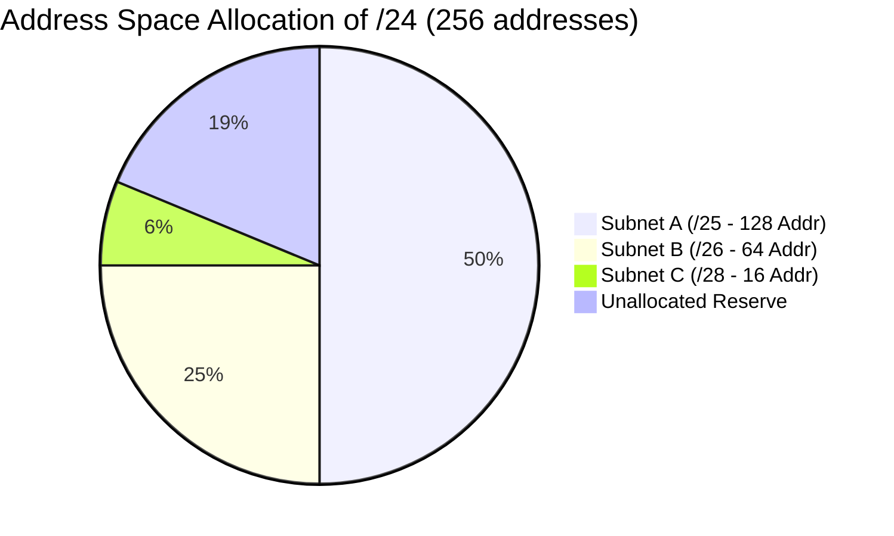

> [!definition] Variable Length Subnet Masking (VLSM)
> VLSM allocates subnets of different sizes according to the specific demand of each sub-network, minimizing wasted address space.
> * Subnet blocks are allocated in powers of $2$.
> * The allocation must satisfy the natural binary alignment constraint: a block of size $2^k$ must start at an address divisible by $2^k$.

> [!question] VLSM Design Problem (Forouzan)
> An organization is granted `14.24.74.0/24`. It needs $3$ subnets:
> * Subnet A: $120$ addresses
> * Subnet B: $60$ addresses
> * Subnet C: $10$ addresses
> 
> Design the sub-blocks.

### Design Procedure

1. **Subnet A ($120$ addresses)**:
   * Nearest power of $2$ is $2^7 = 128$ addresses ($h = 7$).
   * Prefix: $32 - 7 = \mathbf{/25}$.
   * Range: `14.24.74.0` to `14.24.74.127` $\implies \mathbf{14.24.74.0/25}$.

2. **Subnet B ($60$ addresses)**:
   * Nearest power of $2$ is $2^6 = 64$ addresses ($h = 6$).
   * Prefix: $32 - 6 = \mathbf{/26}$.
   * Starting address must be aligned to a multiple of $64$ (next free is $128$):
   * Range: `14.24.74.128` to `14.24.74.191` $\implies \mathbf{14.24.74.128/26}$.

3. **Subnet C ($10$ addresses)**:
   * Nearest power of $2$ is $2^4 = 16$ addresses ($h = 4$).
   * Prefix: $32 - 4 = \mathbf{/28}$.
   * Starting address aligned to multiple of $16$ (next free is $192$):
   * Range: `14.24.74.192` to `14.24.74.207` $\implies \mathbf{14.24.74.192/28}$.

---

> [!question] Multi-Tier Hierarchical Partitioning
> Divide `172.16.0.0/16` into $7$ subnets matching host demands: $S_1 = 500$, $S_2 = 200$, $S_3 = 100$, $S_4 = 60$, $S_5 = 20$, $S_6 = 2$, $S_7 = 2$.

| Subnet | Hosts Needed | Allocated Size ($2^k$) | Prefix Length | Range |
| :--- | :--- | :--- | :--- | :--- |
| **$S_1$** | $500$ | $2^9 = 512$ | $/23$ | `172.16.0.0` – `172.16.1.255` |
| **$S_2$** | $200$ | $2^8 = 256$ | $/24$ | `172.16.2.0` – `172.16.2.255` |
| **$S_3$** | $100$ | $2^7 = 128$ | $/25$ | `172.16.3.0` – `172.16.3.127` |
| **$S_4$** | $60$ | $2^6 = 64$ | $/26$ | `172.16.3.128` – `172.16.3.191` |
| **$S_5$** | $20$ | $2^5 = 32$ | $/27$ | `172.16.3.192` – `172.16.3.223` |
| **$S_6$** | $2$ | $2^2 = 4$ | $/30$ | `172.16.3.224` – `172.16.3.227` |
| **$S_7$** | $2$ | $2^2 = 4$ | $/30$ | `172.16.3.228` – `172.16.3.231` |
