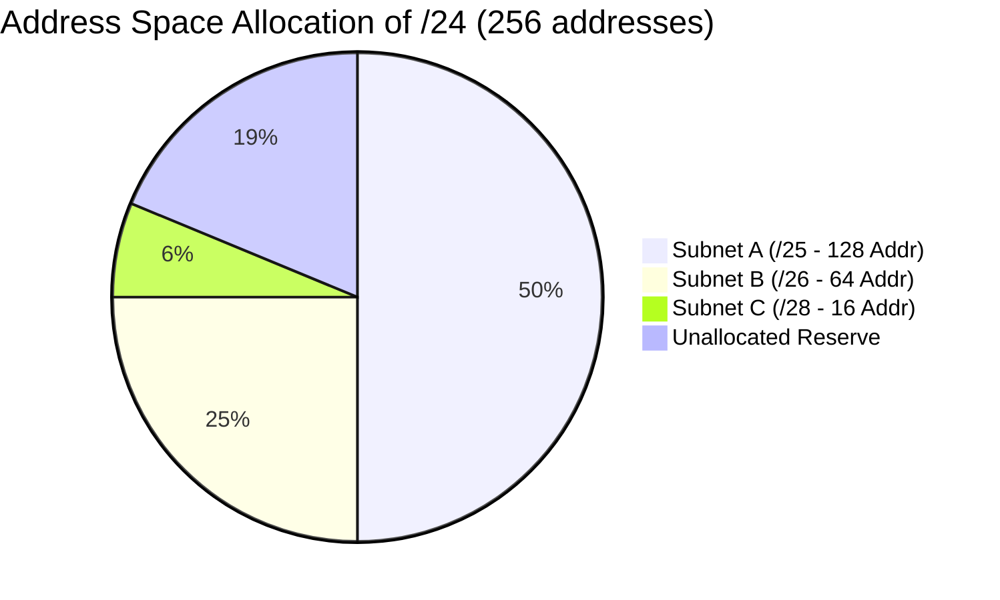

> [!definition] Variable Length Subnet Masking (VLSM)
> VLSM allocates subnets of different sizes according to the specific demand of each sub-network, minimizing wasted address space[cite: 1].
> * Subnet blocks are allocated in powers of $2$[cite: 1].
> * The allocation must satisfy the natural binary alignment constraint: a block of size $2^k$ must start at an address divisible by $2^k$[cite: 1].

> [!question] VLSM Design Problem (Forouzan)
> An organization is granted `14.24.74.0/24`[cite: 1]. It needs $3$ subnets[cite: 1]:
> * Subnet A: $120$ addresses[cite: 1]
> * Subnet B: $60$ addresses[cite: 1]
> * Subnet C: $10$ addresses[cite: 1]
> 
> Design the sub-blocks[cite: 1].

### Design Procedure

1. **Subnet A ($120$ addresses)**:
   * Nearest power of $2$ is $2^7 = 128$ addresses ($h = 7$)[cite: 1].
   * Prefix: $32 - 7 = \mathbf{/25}$[cite: 1].
   * Range: `14.24.74.0` to `14.24.74.127` $\implies \mathbf{14.24.74.0/25}$[cite: 1].

2. **Subnet B ($60$ addresses)**:
   * Nearest power of $2$ is $2^6 = 64$ addresses ($h = 6$)[cite: 1].
   * Prefix: $32 - 6 = \mathbf{/26}$[cite: 1].
   * Starting address must be aligned to a multiple of $64$ (next free is $128$):
   * Range: `14.24.74.128` to `14.24.74.191` $\implies \mathbf{14.24.74.128/26}$[cite: 1].

3. **Subnet C ($10$ addresses)**:
   * Nearest power of $2$ is $2^4 = 16$ addresses ($h = 4$)[cite: 1].
   * Prefix: $32 - 4 = \mathbf{/28}$[cite: 1].
   * Starting address aligned to multiple of $16$ (next free is $192$):
   * Range: `14.24.74.192` to `14.24.74.207` $\implies \mathbf{14.24.74.192/28}$[cite: 1].

---

> [!question] Multi-Tier Hierarchical Partitioning
> Divide `172.16.0.0/16` into $7$ subnets matching host demands: $S_1 = 500$, $S_2 = 200$, $S_3 = 100$, $S_4 = 60$, $S_5 = 20$, $S_6 = 2$, $S_7 = 2$[cite: 1].

| Subnet | Hosts Needed | Allocated Size ($2^k$) | Prefix Length | Range |
| :--- | :--- | :--- | :--- | :--- |
| **$S_1$** | $500$[cite: 1] | $2^9 = 512$[cite: 1] | $/23$[cite: 1] | `172.16.0.0` – `172.16.1.255`[cite: 1] |
| **$S_2$** | $200$[cite: 1] | $2^8 = 256$[cite: 1] | $/24$[cite: 1] | `172.16.2.0` – `172.16.2.255`[cite: 1] |
| **$S_3$** | $100$[cite: 1] | $2^7 = 128$[cite: 1] | $/25$[cite: 1] | `172.16.3.0` – `172.16.3.127`[cite: 1] |
| **$S_4$** | $60$[cite: 1] | $2^6 = 64$[cite: 1] | $/26$[cite: 1] | `172.16.3.128` – `172.16.3.191`[cite: 1] |
| **$S_5$** | $20$[cite: 1] | $2^5 = 32$[cite: 1] | $/27$[cite: 1] | `172.16.3.192` – `172.16.3.223`[cite: 1] |
| **$S_6$** | $2$[cite: 1] | $2^2 = 4$[cite: 1] | $/30$[cite: 1] | `172.16.3.224` – `172.16.3.227`[cite: 1] |
| **$S_7$** | $2$[cite: 1] | $2^2 = 4$[cite: 1] | $/30$[cite: 1] | `172.16.3.228` – `172.16.3.231`[cite: 1] |
