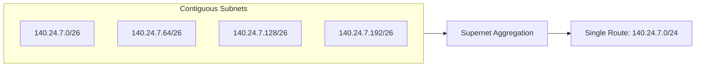

> [!definition] Supernetting (Route Aggregation)
> Supernetting is the logical aggregation of multiple contiguous smaller network prefixes into a single, combined routing table entry (supernet).
> * **Distinction**: Subnetting is a physical design tool that creates smaller networks to control broadcast domains; supernetting is a routing optimization technique designed to minimize the size of forwarding tables in routers.

> [!theorem] Three Necessary Rules for Route Aggregation
> To aggregate $N$ CIDR blocks into a valid supernet:
> 1. The blocks must be contiguous in address space.
> 2. The number of blocks $N$ must be a power of $2$ ($2^k$).
> 3. The base starting address of the aggregate block must be evenly divisible by the total combined size i.e. clear the last $k$ bits.

> [!question] Aggregating Forwarding Table Entries
> Consider router $R_2$ receiving routes from four subnets via a single interface $m_1$:
> * `140.24.7.0/26` $\to m_1$
> * `140.24.7.64/26` $\to m_1$
> * `140.24.7.128/26` $\to m_1$
> * `140.24.7.192/26` $\to m_1$
> 
> Can these entries be aggregated?

### Derivation

All four blocks have size $64$ ($2^6$), are contiguous, span the entire range `140.24.7.0` to `140.24.7.255`, and map to the exact same interface $m_1$.
$$\text{Aggregate Prefix} = 26 - \log_2(4) = 26 - 2 = 24$$

The router replaces all four entries with a single entry:
$$\mathbf{140.24.7.0/24 \longrightarrow m_1}$$

> [!trap] Common Interface Requirement
> Routes can be aggregated into a single routing table entry **if and only if** they share the identical next-hop router or output interface. If routes point to different physical interfaces, they cannot be aggregated into a single forwarding entry.
