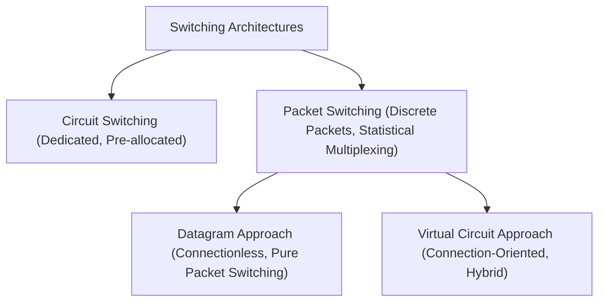

## Switching Paradigms

> [!definition] Switching Paradigms
> * **Circuit Switching**: Establishes a dedicated, physical end-to-end path before data flow begins. Resources (bandwidth, buffers) are strictly reserved for the duration of the call, even during silent periods.
> * **Packet Switching**: Breaks data into discrete chunks called **packets**. Each packet carries header metadata so intermediate switches can route it independently using dynamic, shared resources (statistical multiplexing).
> 
> 

---

### Circuit vs. Packet Switching Invariants

| Attribute | Circuit Switching | Packet Switching (Datagram) |
| --- | --- | --- |
| **Path Allocation** | Reserved end-to-end dedicated circuit | Dynamically allocated per packet |
| **Data Flow** | Continuous bitstream (no headers/chunks) | Discrete packets with individual headers |
| **Link Utilization** | Low (sit idle during silent bursts) | High (unused capacity instantly taken by others) |
| **Overhead** | Fixed initial setup & teardown delays | Per-packet header bits, queuing, & processing |
| **Congestion Behavior** | Call blocking (new requests rejected) | Packet queuing in buffers (drops on overflow) |

---

### Datagram vs. Virtual Circuit Approaches

#### 1. Datagram Approach (Connectionless)

* **Independent Routing:** Every packet contains full source and destination IP addresses and is routed independently.
* **No Call Setup:** Zero connection setup/teardown latency before data transfer starts.
* **Out-of-Order Delivery:** Packets of the same message can take different paths and arrive out of order.
* **High Fault Tolerance:** If a router or link fails, subsequent packets dynamically reroute around the failure.

#### 2. Virtual Circuit (VC) Approach (Connection-Oriented)

* **Logical Pre-routing:** A fixed logical path is chosen using a setup signaling message ("call packet") before data transmission.
* **Short Identifiers:** Packets carry a lightweight **Virtual Circuit Identifier (VCI)** instead of full IP addresses.
* **Switch Forwarding Tables:** Each switch maps `(Incoming Port, Incoming VCI) -> (Outgoing Port, Outgoing VCI)`.
* **Single Point of Path Failure:** If a link along the VC fails, the entire virtual circuit breaks and must be torn down and re-established.

---

### Delay Models & Formulas

> [!tip] Intuitive Core Mental Model
> * **Circuit Switching = Continuous Water Pipe:** Once the setup is complete, data flows like fluid. The last bit leaves the source and travels straight to the destination without stopping at intermediate switches.
> * **Packet Switching = Assembly Line / Store-and-Forward:** Every intermediate router must fully receive, store, and re-transmit a packet before passing it along.
> 
> 

#### 1. Circuit Switching Total Latency

$$T_{\text{circuit}} = T_{\text{setup}} + \frac{L_{\text{msg}}}{B} + K \cdot \frac{d}{v} + T_{\text{teardown}}$$

> [!abstract] Intuitive Term Breakdown
> * **$T_{\text{setup}}$**: Time to make reservations across all $K$ links.
> * **$\frac{L_{\text{msg}}}{B}$**: Time for source NIC to push all $L_{\text{msg}}$ bits into the physical wire.
> * **$K \cdot \frac{d}{v}$**: Total signal propagation delay across all $K$ physical links ($d = \text{distance}$, $v = \text{wave velocity}$).
> * **$T_{\text{teardown}}$**: Time to release reserved circuits across intermediate switches.
> 
> 

---

#### 2. Packet Switching Total Latency ($N$ Packets across $K$ Hops)

##### Assembly Line Formulation (Most Intuitive)

$$\text{Latency}_{\text{PS}} = \underbrace{(N + K - 1) \cdot T_t}_{\text{Total Transmission Turns}} + \underbrace{K \cdot T_p}_{\text{Physical Wire Travel}} + \underbrace{(K - 1) \cdot (T_{\text{proc}} + T_{\text{queue}})}_{\text{Intermediate Switch Overhead}}$$

> [!abstract] Intuitive Term Breakdown
> * **$T_t = \frac{\text{Packet Size}}{B}$** (Transmission delay per packet)
> * **$T_p = \frac{d}{v}$** (Propagation delay per hop)
> * **$(N + K - 1) \cdot T_t$**:
> * **$N \cdot T_t$**: Source takes $N$ turns to dump all $N$ packets onto the wire.
> * **$(K - 1) \cdot T_t$**: Once source finishes, the **last packet** still needs $(K - 1)$ store-and-forward turns across the remaining intermediate routers.
> 
> 
> * **$K \cdot T_p$**: Spatial propagation travel time across all $K$ links.
> * **$(K - 1) \cdot (T_{\text{proc}} + T_{\text{queue}})$**: Total time spent looking up headers ($T_{\text{proc}}$) and waiting in buffer queues ($T_{\text{queue}}$) at the $(K - 1)$ intermediate routers.
> 
> 

##### Pipeline Equivalent Formulation

$$T_{\text{packet}} = K \cdot (T_t + T_p) + (K - 1)(T_{\text{proc}} + T_{\text{queue}}) + (N - 1) \cdot T_t$$

---
