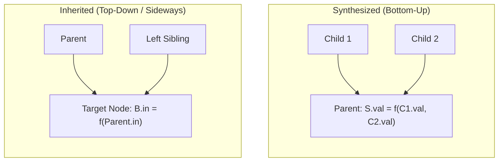

> [!definition]
> - **Syntax-Directed Definition (SDD)**: A context-free grammar augmented with attributes and semantic rules.
> - **Synthesized Attribute**: Computed exclusively from the attribute values of the node's **children** in the parse tree (bottom-up flow: Child $\to$ Parent).
> - **Inherited Attribute**: Computed from the attribute values of the node's **parent and/or siblings** (top-down or sideways flow: Parent/Sibling $\to$ Node).

> [!theorem]
> **Classification of SDDs**:
> 1. **S-Attributed SDD**:
>    - Uses **ONLY synthesized attributes**.
>    - Semantic actions are placed strictly at the **extreme right end** of productions.
>    - Evaluated naturally during bottom-up parsing ($LR$ parsers) in **Reverse Rightmost Derivation (RRMD)** order.
> 2. **L-Attributed SDD**:
>    - Attributes can be synthesized OR restricted inherited.
>    - Inherited attributes for symbol $X_j$ in $A \to X_1 X_2 \dots X_n$ can depend ONLY on:
>      1. Inherited attributes of parent $A$.
>      2. Synthesized or inherited attributes of **left siblings** $X_1, X_2, \dots, X_{j-1}$.
>    - Semantic actions can appear **anywhere within the RHS**.
>    - Evaluated in a single **depth-first, left-to-right (in-order)** parse tree traversal.
>
> **Class Invariant**: Every S-attributed grammar is unconditionally an L-attributed grammar ($\text{S-Attributed} \subset \text{L-Attributed}$).

> [!trap]
> If a semantic rule assigns an attribute to a non-terminal using values from its **right sibling**, the definition is **NOT L-attributed**. For example, in $S \to A B$, the action $\{A.x = B.y\}$ violates L-attributed rules.

> [!question]
> Consider the production $A \to B C$ with semantic action $\{B.x = f(A.y, C.z)\}$, where $A.y$ is an inherited attribute. Which statement is TRUE?
> - (A) The grammar is S-attributed.
> - (B) The grammar is L-attributed.
> - (C) The grammar is neither S-attributed nor L-attributed.
> - (D) The attribute $B.x$ is synthesized.
>
> **Correct Option**: **(C)**
> **Explanation**: $B.x$ is an inherited attribute because it is defined on the RHS. In L-attributed definitions, a node may only inherit from its parent ($A$) or left siblings. Since $C$ is a right sibling to $B$, computing $B.x$ from $C.z$ violates L-attribution. It contains an inherited attribute, so it cannot be S-attributed.
