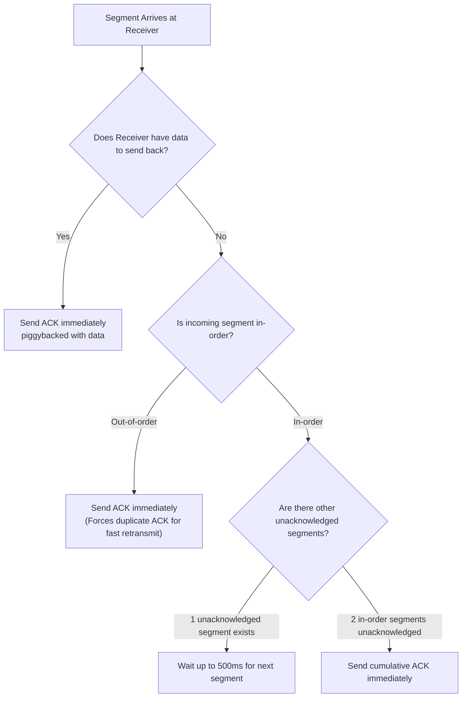

While TCP uses cumulative acknowledgments, it optimizes network bandwidth by delaying ACKs under RFC 1122 and RFC 5681 guidelines[cite: 1].

### Cumulative ACK Rules
1. **Piggybacking**: If the receiver has outgoing data, it piggybacks the ACK number in the outgoing data segment[cite: 1].
2. **Delayed ACK**: If an in-order segment arrives and no data is ready to transmit, the receiver waits up to $500\text{ ms}$ for the next segment to arrive so it can acknowledge both with a single ACK[cite: 1].
3. **At Least One ACK per 2 Segments**: The receiver must not delay ACKs for more than $2$ consecutive full-sized in-order segments[cite: 1].
4. **Immediate Out-of-Order ACK**: If an out-of-order segment arrives (gap detected), an ACK indicating the expected in-order byte must be generated immediately[cite: 1].
