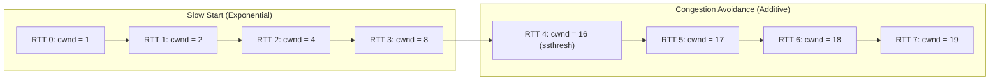

TCP Reno controls the Congestion Window (`cwnd`) using two primary phases separated by a Slow Start Threshold (`ssthresh`)[cite: 1].

### 1. Slow Start Phase ($\text{cwnd} < \text{ssthresh}$)
* **Growth Rate**: Exponential increase per Round Trip Time (RTT)[cite: 1].
* For every valid ACK received, `cwnd` increments by $1\text{ MSS}$:
  $$\text{cwnd} \leftarrow \text{cwnd} + 1\text{ MSS (per ACK received)}$$
[cite: 1]
* Over one complete RTT (when all acknowledged segments return), `cwnd` doubles:
  $$\text{cwnd} \leftarrow 2 \times \text{cwnd (per RTT)}$$
[cite: 1]

### 2. Congestion Avoidance Phase ($\text{cwnd} \ge \text{ssthresh}$)
* **Growth Rate**: Additive Increase per RTT (AIMD — Additive Increase, Multiplicative Decrease)[cite: 1].
* For each ACK received, `cwnd` increases by a fraction of an MSS:
  $$\text{cwnd} \leftarrow \text{cwnd} + \frac{1}{\text{cwnd}}\text{ MSS (per ACK received)}$$
[cite: 1]
* Over one complete RTT, `cwnd` increases by exactly $1\text{ MSS}$:
  $$\text{cwnd} \leftarrow \text{cwnd} + 1\text{ MSS (per RTT)}$$
[cite: 1]

> [!formula] General Fraction Update Rule in Congestion Avoidance
> If the current congestion window is $y\text{ Bytes}$ and an acknowledgment confirms $x\text{ Bytes}$ of data:
> $$\Delta \text{cwnd} = \text{MSS} \times \frac{x}{y}$$[cite: 1]

### Response to Loss Events (TCP Reno Rules)
1. **Upon Timeout (Heavy Congestion)**:
   * $\text{ssthresh} = \lfloor \frac{\text{cwnd}}{2} \rfloor$[cite: 1]
   * $\text{cwnd} = 1\text{ MSS}$[cite: 1]
   * Enter **Slow Start**[cite: 1].
2. **Upon 3 Duplicate ACKs (Mild Congestion)**:
   * $\text{ssthresh} = \lfloor \frac{\text{cwnd}}{2} \rfloor$[cite: 1]
   * $\text{cwnd} = \text{ssthresh}$ (in TCP Reno / Fast Recovery)[cite: 1]
   * Enter **Congestion Avoidance** directly (skipping Slow Start)[cite: 1].

> [!trap] Updating ssthresh Without Prior Loss
> If the initial `ssthresh` is not explicitly provided in a problem, do not assume an arbitrary threshold[cite: 1]. Continue in Slow Start (exponential growth) until the first packet loss occurs[cite: 1]. Once loss occurs, `ssthresh` is set to $\frac{\text{cwnd}}{2}$[cite: 1].
