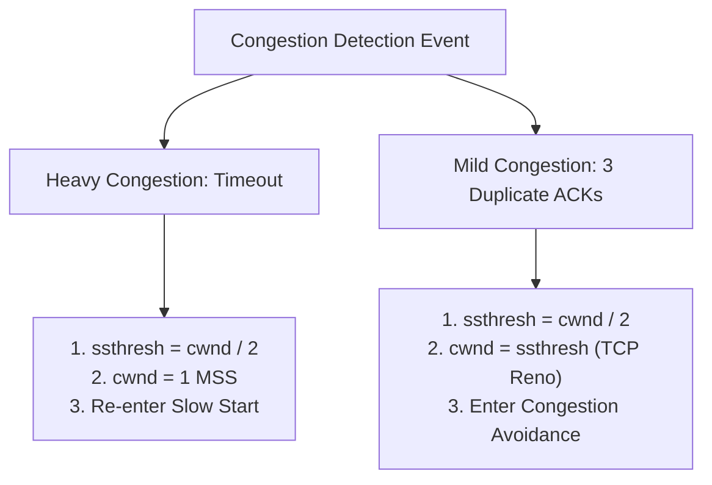

Because routers generally do not send explicit warning signals when their queues fill up, a TCP sender must infer network congestion through observed packet loss[cite: 1].

> [!definition] Congestion Classification
> 1. **Heavy (Severe) Congestion — Timeout**:
>    * Occurs when the sender's Retransmission Timeout (RTO) timer expires before receiving an ACK[cite: 1].
>    * Signals that either the transmitted data segment or its returning ACK was dropped, meaning routers are completely saturated and dropping packets wholesale[cite: 1].
> 2. **Mild Congestion — 3 Duplicate ACKs**:
>    * Occurs when the sender receives $3$ identical duplicate ACKs ($4$ ACKs total with the same ACK number)[cite: 1].
>    * Signals that a single packet was lost, but subsequent packets successfully crossed the network and reached the receiver[cite: 1].
>    * Proves the network is still transferring packets, indicating isolated loss rather than catastrophic collapse[cite: 1].

> [!trap] 3 Duplicate ACKs vs 3 ACKs
> Receiving $3$ duplicate ACKs requires receiving the original in-order acknowledgment **plus $3$ additional copies** carrying the identical ACK number (a total of $4$ matching ACKs)[cite: 1].
