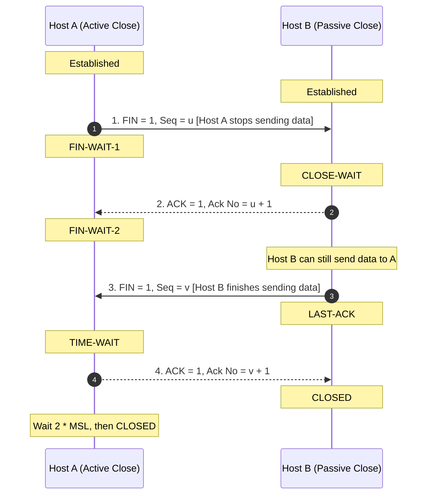

TCP connection teardown is asymmetric; each half of the full-duplex channel is terminated independently[cite: 1]. It typically operates as a 4-way handshake, though it can collapse to 3 packets if the responding party piggybacks its FIN with its ACK[cite: 1].

### Half-Closed Connection Properties
* After Host $A$ sends its FIN and receives an ACK, it enters `FIN-WAIT-2`[cite: 1].
* Host $A$ can **no longer send data**, but it **can still receive data** sent by Host $B$[cite: 1].
* Host $B$ resides in `CLOSE-WAIT` until its application finishes sending remaining data and closes its socket[cite: 1].

> [!trap] Number of Segments to Close a TCP Connection
> A TCP connection requires **either 3 or 4 segments** to close[cite: 1]:
> * **4 Segments**: Standard independent termination ($\text{FIN} \to \text{ACK} \to \text{FIN} \to \text{ACK}$)[cite: 1].
> * **3 Segments**: If Host $B$ has no pending data, it combines its ACK and FIN into a single segment ($\text{FIN} \to [\text{FIN}+\text{ACK}] \to \text{ACK}$)[cite: 1].
