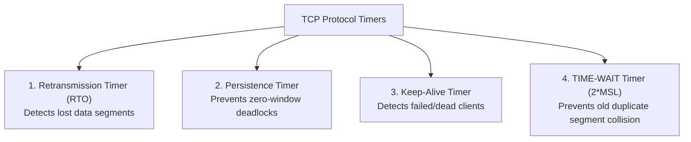

TCP relies on four core operational timers to handle communication anomalies[cite: 1].

### 1. Retransmission Timer (RTO)
* Started whenever a segment is transmitted; cleared when its corresponding ACK is received[cite: 1].
* If the timer expires before the ACK arrives, the segment is retransmitted[cite: 1].

> [!formula] Jacobson's RTT Smoothing Formula
> Round-Trip Time fluctuates continuously across network hops[cite: 1]. TCP calculates a smoothed estimated RTT ($SRTT$) using an exponential weighted moving average (EWMA) with smoothing factor $\alpha$ (typically $\alpha \approx 0.125$)[cite: 1]:
> $$SRTT_n = (1 - \alpha) \cdot SRTT_{n-1} + \alpha \cdot (\text{Sample RTT}_n)$$[cite: 1]
> $$\text{RTO} = 2 \times SRTT \quad \text{(or } SRTT + 4 \times \text{RTT Variance)}$$[cite: 1]

### 2. Persistence Timer (Zero-Window Deadlock Prevention)
* **The Deadlock Condition**: A receiver advertises $\text{rwnd} = 0$ when its buffer is full, halting sender transmissions[cite: 1]. Later, when buffer space frees up, the receiver sends a window update ($\text{rwnd} > 0$), but this ACK packet is lost in the network[cite: 1].
* The sender is waiting for the receiver to advertise space; the receiver believes space was advertised and waits for data, creating a permanent **deadlock**[cite: 1].
* **The Solution**: When $\text{rwnd} = 0$ is received, the sender starts a **Persistence Timer**[cite: 1]. When it expires, the sender transmits a small **Probe Segment** ($1\text{ Byte}$ payload)[cite: 1]. The probe forces the receiver to respond with an ACK re-advertising its current `rwnd`[cite: 1].

### 3. Keep-Alive Timer
* Prevents a server from maintaining an open, idle TCP connection indefinitely if a client crashes or becomes disconnected[cite: 1].
* Typically set to $2\text{ hours}$[cite: 1]. If no data is received during this window, the server transmits probe segments[cite: 1]. If no response is received after $10$ consecutive probes, the server terminates the connection[cite: 1].

### 4. TIME-WAIT Timer ($2 \times \text{MSL}$)
* Enforced at the endpoint performing an **active close** after sending the final ACK[cite: 1].
* Maximum Segment Lifetime (MSL) is the maximum time a packet can survive in the network before being discarded (typically $30\text{ to } 120\text{ seconds}$)[cite: 1].
* The endpoint remains in `TIME-WAIT` for $2 \times \text{MSL}$ to satisfy two conditions:
  1. **Reliable Teardown**: Ensures the final ACK was received[cite: 1]. If lost, the peer's retransmitted FIN will arrive before the local port is closed, allowing re-transmission of the final ACK[cite: 1].
  2. **Draining Old Duplicates**: Allows any wandering, delayed duplicate segments from the old connection to expire in the network before a new incarnation can bind to the same socket address[cite: 1].
