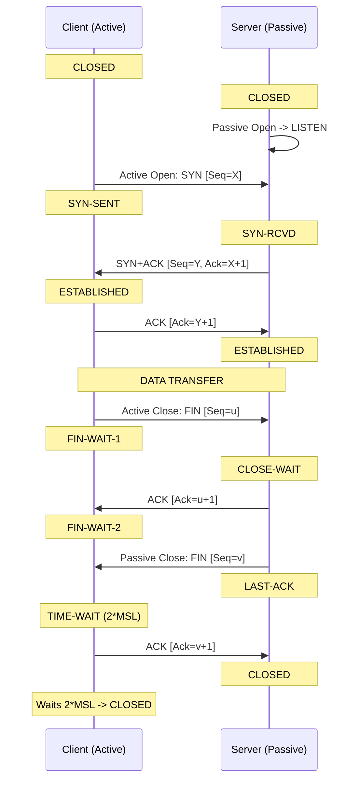

TCP connection lifecycles transition through eleven distinct formal states defined in RFC 793[cite: 1].

| State Name | Endpoint Type | Functional Description |
| :--- | :--- | :--- |
| **CLOSED** | Both | Fictional state; no active connection exists[cite: 1]. |
| **LISTEN** | Server | Passive open; server waits for incoming connection requests[cite: 1]. |
| **SYN-SENT** | Client | Active open; client sent SYN segment and awaits SYN+ACK[cite: 1]. |
| **SYN-RECEIVED** | Server | Server received SYN, sent SYN+ACK, and awaits client's final ACK[cite: 1]. |
| **ESTABLISHED** | Both | Connection is operational; full-duplex data transfer active[cite: 1]. |
| **FIN-WAIT-1** | Client (Active Close) | Host initiated termination by sending FIN; awaits ACK or FIN[cite: 1]. |
| **FIN-WAIT-2** | Client (Active Close) | Host received ACK for its FIN; awaits peer's FIN[cite: 1]. |
| **CLOSE-WAIT** | Server (Passive Close) | Host received FIN, sent ACK; waiting for local application to close[cite: 1]. |
| **LAST-ACK** | Server (Passive Close) | Host sent its own FIN; awaits final terminating ACK[cite: 1]. |
| **TIME-WAIT** | Client (Active Close) | Host sent final ACK; waits $2 \times \text{MSL}$ to ensure network is clear[cite: 1]. |
| **CLOSING** | Both (Simultaneous Close)| Rare; both sides sent FIN simultaneously and await mutual ACKs. |

