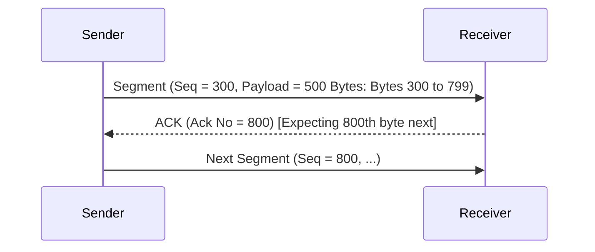

### Sequence Number Assignment Rules
* **Initial Sequence Number (ISN)**: The sequence number assigned to the very first byte transmitted in a given direction is chosen randomly during connection setup to prevent confusion with delayed segments from previous connections[cite: 1].
* **Segment Sequence Number**: The sequence number carried in the TCP header of a segment is defined as the sequence number of the **first data byte** contained within that segment[cite: 1]:
  $$\text{Seq No}_{\text{seg}} = \text{ISN} + \text{Cumulative Bytes Sent Before This Segment}$$
[cite: 1]

> [!definition] Cumulative Acknowledgment
> TCP utilizes **Cumulative Acknowledgments**[cite: 1]. The **Acknowledgment Number (ACK No)** sent by a host specifies the sequence number of the **next byte expected** from the sender[cite: 1].
> * An acknowledgment number $N$ confirms that all preceding bytes from $\text{ISN}$ through $N - 1$ have been received successfully[cite: 1].
> * A pure TCP ACK segment that carries no application payload consumes **zero sequence numbers**[cite: 1].

> [!question] Consecutive Segments and Cumulative ACKs
> Host $A$ sends two back-to-back segments to Host $B$ over an established TCP connection[cite: 1].
> * First segment: carries $80\text{ Bytes}$ with $\text{Seq} = 127$[cite: 1].
> * Second segment: carries $40\text{ Bytes}$[cite: 1].
> 
> 1. What is the sequence number of the second segment[cite: 1]?
> 2. If segments arrive in order, what are the ACK numbers returned by Host $B$[cite: 1]?
> 3. If the first segment is lost but the second segment arrives, what ACK number is returned[cite: 1]?

* **Solution**:
  1. The first segment consumes bytes $127$ through $127 + 80 - 1 = 206$[cite: 1].
     The sequence number of the second segment is:
     $$\text{Seq}_2 = 127 + 80 = 207$$
[cite: 1]
  2. If received in order:
     * After segment 1: Host $B$ expects byte $207 \implies \mathbf{\text{ACK}} = \mathbf{207}$[cite: 1].
     * After segment 2 (bytes $207$ through $246$): Host $B$ expects byte $247 \implies \mathbf{\text{ACK}} = \mathbf{247}$[cite: 1].
  3. If segment 1 is lost and segment 2 arrives out of order:
     * Host $B$ has only received up to byte $126$[cite: 1].
     * Because TCP ACKs are strictly cumulative, Host $B$ cannot acknowledge byte $207$[cite: 1]. It replies with:
       $$\mathbf{\text{ACK}} = \mathbf{127}$$
[cite: 1]
       (Indicating byte $127$ is the first outstanding, missing byte)[cite: 1].
