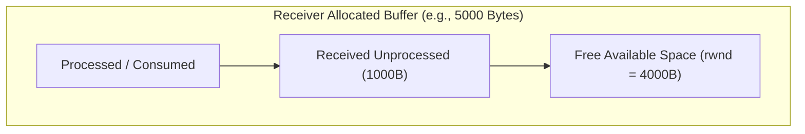

> [!definition] Flow Control
> Flow control is an end-to-end mechanism designed to match the sender's transmission rate to the receiver's processing speed, preventing a fast sender from overflowing a slow receiver's buffer[cite: 1].

### Receiver Window Dynamics
* Every TCP segment header includes a $16$-bit **Receiver Window Size (rwnd)** field[cite: 1].
* The receiver advertises its currently available buffer space in every acknowledgment[cite: 1].

> [!formula] Receiver Window Calculation
> $$\text{rwnd} = \text{Total Allocated Buffer Size} - \text{Buffered Unprocessed Data}$$[cite: 1]

> [!question] GATE CS 2021: Advertised Window Calculation
> Host $B$ has an allocated receive buffer size of $5000\text{ Bytes}$[cite: 1]. If the receiver currently holds $1000\text{ Bytes}$ of received, unprocessed application data, what value of `rwnd` will Host $B$ advertise to Host $A$ in its next header[cite: 1]?
> * Total Buffer $= 5000\text{ Bytes}$[cite: 1]
> * Occupied $= 1000\text{ Bytes}$[cite: 1]
> * $\text{rwnd} = 5000 - 1000 = \mathbf{4000\text{ Bytes}}$[cite: 1]

### Sender Window Bound
The sender's effective transmission window is dynamically constrained by the advertised window:
$$\text{Sender Permitted Unacknowledged Bytes} \le \text{rwnd}$$
[cite: 1]
The sender is forbidden from transmitting more than `rwnd` unacknowledged bytes, guaranteeing zero buffer overflow at the destination[cite: 1].
