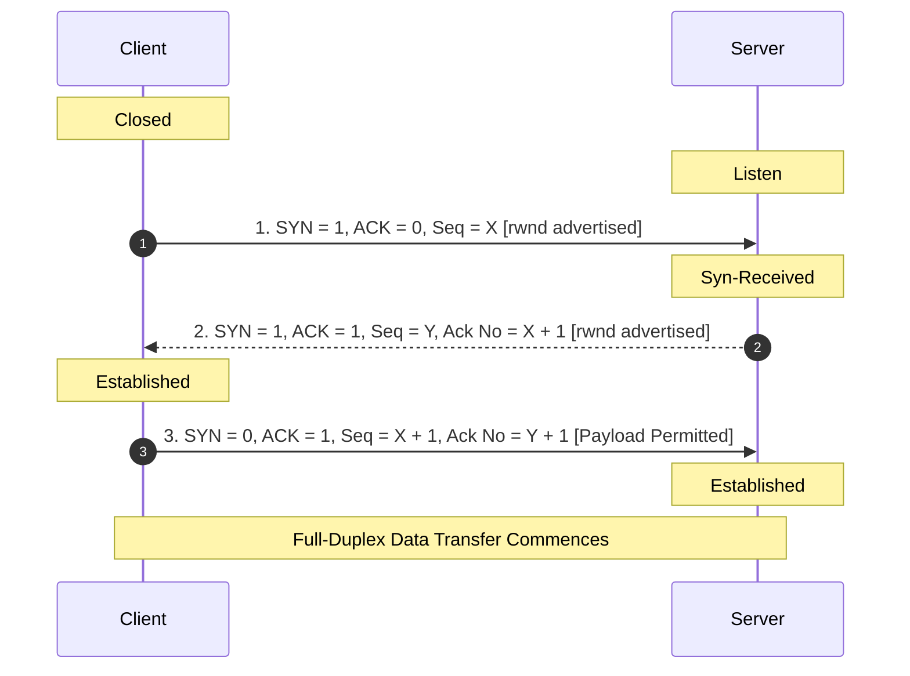

TCP establishes a full-duplex connection between client and server using a 3-way handshaking procedure[cite: 1].

### Handshake Sequence Analysis
1. **Packet 1 (SYN from Client)**:
   * Client selects a random initial sequence number $\text{ISN}_C = X$[cite: 1].
   * Sets $\text{SYN} = 1, \text{ACK} = 0$, consumes $1$ sequence number[cite: 1].
   * Cannot carry application data[cite: 1].
2. **Packet 2 (SYN + ACK from Server)**:
   * Server selects its own random initial sequence number $\text{ISN}_S = Y$[cite: 1].
   * Sets $\text{SYN} = 1, \text{ACK} = 1$[cite: 1].
   * Acknowledges client's SYN by setting $\text{Ack No} = X + 1$[cite: 1].
   * Consumes $1$ sequence number; cannot carry application data[cite: 1].
3. **Packet 3 (ACK from Client)**:
   * Client acknowledges server's SYN by setting $\text{Ack No} = Y + 1$[cite: 1].
   * Sequence number is $\text{Seq} = X + 1$[cite: 1].
   * Sets $\text{SYN} = 0, \text{ACK} = 1$[cite: 1].
   * **Piggybacking**: Packet 3 **can carry application data**; if it carries data, it consumes sequence numbers proportional to payload bytes[cite: 1].

> [!trap] Loss of Third Handshake Packet
> If the third packet (ACK from client) is lost in transit, the server's retransmission timer will expire, prompting the server to retransmit the **SYN + ACK** packet[cite: 1]. The client learns of the lost ACK upon receiving the duplicate SYN + ACK and retransmits the final ACK[cite: 1].

> [!question] Handling Old Delayed Duplicate SYN Packets
> What happens if a delayed, duplicate SYN packet from an old, defunct connection attempt from Host $A$ suddenly arrives at Host $B$[cite: 1]?
> * Host $B$ assumes a new connection is being requested and replies with a **SYN + ACK** packet[cite: 1].
> * Host $A$ receives this SYN + ACK for a connection it never initiated[cite: 1].
> * Host $A$ immediately replies with a **RST (Reset)** packet ($\text{RST} = 1$), commanding Host $B$ to tear down the half-open connection state immediately[cite: 1].
